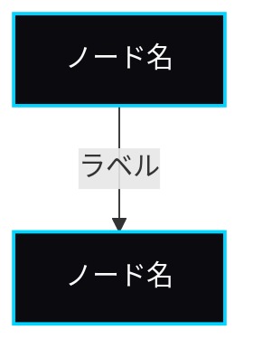

# コンテンツ向けビジュアル制作プレイブック

> Visualizer Agentがコンテンツ用ビジュアルを制作する際の標準手順書
> 最終更新: 2026-03-05（v2: 3Dレンダリング・Canva MCP連携・VISUALタグ新フォーマット・インフォグラフィックツール追加）

---

## 概要

Writer Agentから記事を受け取り、ブランドガイドラインに準拠したビジュアルを制作して納品する。
1記事あたり最低3点（ヒーロー画像 + インライン図解2点）、理想5点のビジュアルを生成する。

---

## Step 1: 記事の受け取りとビジュアル機会の特定

### 1-1. 記事を読み込む

Writer Agentから受け取った記事（またはアウトライン）を精読する。

確認項目:
- 記事テーマ・主題
- ターゲット読者層
- 記事のトーン（解説系 / 体験談系 / ニュース系 / 提案系）
- `<!-- VISUAL: -->` タグの有無と内容（新フォーマット）
- `<!-- IMAGE: -->` プレースホルダーの有無と内容（旧フォーマット・互換対応）

### 1-2. ビジュアル機会を洗い出す

記事内で以下のパターンを探す:

| パターン | ビジュアルタイプ | 優先度 | 推奨ツール |
|---------|----------------|--------|-----------|
| 記事冒頭 | ヒーロー画像 | **必須** | Nano Banana Pro |
| プロセス・手順の説明 | フローチャート | **必須** | Mermaid |
| 比較・対比 | 比較表 or 棒グラフ | **必須** | HTML/CSS |
| 数値データの提示 | スタッツカード / グラフ | 高 | HTML/CSS |
| 抽象概念の説明 | 3Dアイソメトリック | 高 | Nano Banana Pro / Tripo3D |
| システム構成 | アーキテクチャ図 | 中 | Mermaid |
| 時系列の変化 | タイムライン | 中 | Mermaid / HTML |
| 重要な引用・主張 | 引用カード | 中 | HTML/CSS |
| CTA直前 | CTAビジュアル | 推奨 | Nano Banana Pro |

### 1-3. ビジュアルリストを作成する

```
## ビジュアルリスト: [記事スラッグ]

1. ヒーロー画像
   - テーマ: [具体的な視覚的テーマ]
   - パターン: A/B/C（visual-content-2026.mdのテンプレ参照）
   - ツール: Nano Banana Pro
   - サイズ: 1200x630
   - 展開先: blog, note, x, linkedin

2. 図解01: [タイトル]
   - タイプ: Mermaidフローチャート
   - 内容: [何を図解するか]
   - サイズ: 1200x675
   - 展開先: blog, ig-carousel

3. 図解02: [タイトル]
   - タイプ: HTML/CSSスタッツカード
   - 内容: [表示するデータ]
   - サイズ: 1200x675
   - 展開先: blog, x

4. 3Dレンダリング: [タイトル]
   - テーマ: [3Dで表現する概念]
   - ツール: Nano Banana Pro
   - サイズ: 1200x675
   - 展開先: blog, instagram

5. SNSカード: X用
   - テキスト: [メインメッセージ]
   - ツール: Ideogram 3.0
   - サイズ: 1200x675
```

### 1-4. ビジュアル不足の場合の自動補完

Writer Agentからの記事にVISUALタグが不足している場合、以下の基準で追加提案する:

| 記事の長さ | 最低ビジュアル数 | 追加提案の基準 |
|-----------|---------------|--------------|
| 1,000語未満 | 2枚 | ヒーロー + 図解1枚 |
| 1,000-2,000語 | 3枚 | ヒーロー + 図解2枚 |
| 2,000-3,000語 | 4枚 | ヒーロー + 図解2枚 + 3D/CTA |
| 3,000語以上 | 5枚以上 | ヒーロー + 図解2枚 + 3D + CTA |

---

## Step 2: ブランドガイドラインの確認

### 2-1. カラーパレット（厳守）

| 用途 | カラーコード | 使用場面 |
|------|------------|---------|
| 背景 | `#050508` | 全画像のベース背景 |
| サーフェス | `#0A0A0F` | カード、パネル、プラットフォーム |
| ボーダー | `#1A1A2E` | 区切り線、枠線 |
| テキスト | `#FAFAFA` | メインテキスト |
| サブテキスト | `#6B7280` | 補足テキスト |
| アクセント | `#00D4FF` | ハイライト、リンク、主要要素 |
| 成功 | `#00FF88` | ポジティブな数値、完了状態 |
| 警告 | `#FFB800` | 注意事項 |
| エラー | `#FF3366` | ネガティブな数値、問題 |

### 2-2. カラー意味対応表

| 意味 | カラー | 用途例 |
|------|--------|-------|
| メインアクセント | #00D4FF | 注目させたい要素、CTA、主役 |
| 成功・ポジティブ | #00FF88 | 成長率、成功指標、完了状態 |
| 警告・注意 | #FFB800 | 注意点、変化、トレンド |
| 否定・問題 | #FF3366 | エラー、課題、Before |
| ニュートラル | #6B7280 | サブ情報、補足、比較対象 |

### 2-3. スタイルチェック

- [ ] ストック写真的な要素がないか
- [ ] ポップすぎる配色がないか
- [ ] 過度な装飾・ドロップシャドウがないか
- [ ] Nothing Tech / Apple のミニマリズムを意識しているか

---

## Step 3: プロンプト生成とビジュアル制作

### 3-1. AI画像生成（ヒーロー画像・3Dイラスト）

#### 使用ツールの選定

| 画像タイプ | 第一選択 | フォールバック | コスト/枚 |
|-----------|---------|--------------|----------|
| ヒーロー画像（テキストなし） | **Nano Banana Pro** | Nano Banana Pro | 無料（50枚/日） |
| テキスト入りサムネイル | **Nano Banana Pro** | Ideogram 3.0 | 無料（テキスト精度94%） |
| 3Dアイソメトリック | **Nano Banana Pro** | Nano Banana Pro | 無料 |
| プロダクトモックアップ | **Nano Banana Pro** | GPT Image | 無料 |
| SNS画像 | **Nano Banana Pro** | HTML/CSS | 無料 |
| ドラフト確認 | **Nano Banana Pro** | — | 無料 |

> **API**: Google AI Studio経由 `nano-banana-pro-preview`。キー: `.secrets/google-ai-studio.key`
> **自動生成**: `tools/generate-visuals.sh <article.md>` で記事内VISUALタグから一括生成

#### 記事テーマ --> ビジュアルスタイル対応表

| 記事テーマ | ヒーロースタイル | 図解スタイル | 3Dスタイル |
|-----------|----------------|-------------|-----------|
| AI技術・ツール紹介 | ガラスモーフィズムUIカード | フローチャート | 浮遊する幾何学オブジェクト |
| 経営戦略・ビジネス | アイソメトリック建築ブロック | 戦略マップ | チェス盤的配置 |
| マーケティング・SEO | データダッシュボード風 | ファネル図 | グラフのホログラム |
| プロダクト開発 | プロダクトモックアップ | システム構成図 | UIのフローティング |
| 業界分析・トレンド | 抽象的ネットワーク | 比較表 | データノード接続 |
| ハウツー・ガイド | ステップ段差構成 | 番号付きプロセス図 | 階段的3Dブロック |
| ファッションEC | 商品フローティング | カスタマージャーニー | プロダクトアレンジ |
| 教育・ワークショップ | ノート/ボード風構成 | ステップバイステップ | 教室的アイソメトリック |

#### プロンプト構成ルール

```
[主題の説明]
[構図・レイアウトの指定]
[ブランドカラーの指定 -- 必ず含める]
  Background: #050508. Accent: #00D4FF. Surface: #0A0A0F. Border: #1A1A2E.
[スタイル指定]
  Dark minimal tech aesthetic. Nothing Tech / Apple inspired.
  No stock photo feel. No pop colors. No excessive decoration.
[技術仕様]
  [サイズ]px. Photorealistic 3D render quality.
[禁止事項]
  No text. No humans (unless specifically required). No watermarks.
```

#### ドラフト確認プロセス

1. まずFLUX.2 klein（$0.014/枚）でドラフトを1-2枚生成
2. 構図・雰囲気を確認
3. 問題なければNano Banana Pro（$0.04/枚）で本番品質を生成
4. 必要に応じてプロンプトを微調整して再生成（最大3回まで）

### 3-2. 3Dレンダリング制作（新規セクション）

#### ツール選択基準

| 用途 | ツール | 理由 |
|------|--------|------|
| ブログ用3Dイラスト | Nano Banana Pro | 2D画像として出力。プロンプト制御が容易 |
| テック系アブストラクト3D | Nano Banana Pro | ダークテーマとの相性最高 |
| 本格3Dモデル生成 | Tripo3D | 20秒生成。4K PBRテクスチャ。ブラウザベース |
| 高品質メッシュ | Meshy AI | クリーンなエッジフロー。プロ向け |
| フォトリアルオブジェクト | Rodin AI | フォトリアリスティック特化 |
| インタラクティブ3D | Tripo3D + Three.js | Web埋め込み用 |

#### 3Dプロンプトパターン

**テック系アブストラクト**
```
A minimal geometric 3D object: [形状名].
Material: dark matte black (#050508) with subtle cyan (#00D4FF) edge emission.
Environment: pure black void with soft ambient occlusion.
Style: Nothing Tech product design meets abstract sculpture.
Clean topology. No noise. No texture map -- pure material and light.
```

**AIシステム構成**
```
Isometric 3D scene: interconnected floating dark platforms (#0A0A0F)
in a black void (#050508). Thin glowing cyan (#00D4FF) light trails
connecting each platform. Central platform slightly larger with brighter glow.
Style: architectural model meets circuit board aesthetic.
```

**データフロー・ネットワーク**
```
3D visualization of a data network. Nodes as small dark spheres
(#0A0A0F) connected by thin luminous cyan (#00D4FF) lines in 3D space.
Background: infinite black (#050508). Depth of field effect.
Style: scientific visualization meets Nothing Tech aesthetic.
```

### 3-3. 図解生成（Mermaid）

#### テーマ設定（全Mermaid図に共通）

```mermaid
%%{init: {'theme': 'dark', 'themeVariables': {
  'primaryColor': '#0A0A0F',
  'primaryTextColor': '#FAFAFA',
  'primaryBorderColor': '#00D4FF',
  'lineColor': '#00D4FF',
  'secondaryColor': '#111116',
  'tertiaryColor': '#1A1A2E',
  'background': '#050508',
  'mainBkg': '#0A0A0F',
  'nodeBorder': '#00D4FF',
  'clusterBkg': '#111116',
  'titleColor': '#FAFAFA',
  'edgeLabelBackground': '#0A0A0F'
}}}%%
```

#### フロー図のスタイル統一



### 3-4. HTML/CSSインフォグラフィック

#### 基本テンプレート

```html
<!DOCTYPE html>
<html lang="ja">
<head>
  <meta charset="UTF-8">
  <style>
    @import url('https://fonts.googleapis.com/css2?family=Inter:wght@400;600;700&family=Noto+Sans+JP:wght@400;700&display=swap');
    * { margin: 0; padding: 0; box-sizing: border-box; }
    body {
      background: #050508;
      color: #FAFAFA;
      font-family: 'Inter', 'Noto Sans JP', sans-serif;
      padding: 48px;
      width: 1200px;
    }
    .accent { color: #00D4FF; }
    .success { color: #00FF88; }
    .warning { color: #FFB800; }
    .card {
      background: #0A0A0F;
      border: 1px solid #1A1A2E;
      border-radius: 12px;
      padding: 24px;
    }
    .grid { display: grid; gap: 16px; }
    .grid-2 { grid-template-columns: repeat(2, 1fr); }
    .grid-3 { grid-template-columns: repeat(3, 1fr); }
    .stat-value { font-size: 2.5rem; font-weight: 700; color: #00D4FF; }
    .stat-label { font-size: 0.875rem; color: #6B7280; margin-top: 4px; }
  </style>
</head>
<body>
  <!-- コンテンツ -->
</body>
</html>
```

#### スクリーンショットの取得方法

1. ブラウザで開いてスクリーンショット（最も簡単）
2. `puppeteer`でヘッドレスキャプチャ（自動化する場合）
3. Vercelにデプロイして`next/og`でOGP画像として動的生成

### 3-5. Canva MCP経由での制作（新規セクション）

#### 対応タスク
- SNS画像の一括生成（テンプレートベース）
- ブログサムネイルのテンプレート化
- ブランドキット準拠のデザイン量産
- Magic Switchで全プラットフォーム向け自動リサイズ

#### 操作手順（Claude Code内）
```
1. Canva MCPツールでブランドキットを参照（list-brand-kits）
2. テンプレートを検索（search-designs）or 新規デザイン作成（generate-design）
3. テキスト・画像要素を自動入力
4. Magic Switchで各プラットフォーム用にリサイズ（resize-design）
5. エクスポート（export-design: PNG/JPG）
```

#### 注意事項
- Brand Guardrailsが有効なため非ブランドカラー/フォントは自動修正される
- Canva Proプラン以上が必要（$15/月）
- 1回の操作で複数サイズを一括生成可能

### 3-6. 外部インフォグラフィックツール活用

データが複雑な場合にMermaid/HTML/CSSで対応しきれない場合:

| ツール | 用途 | 強み |
|--------|------|------|
| Piktochart AI | データ重視のインフォグラフィック | スマートデータエンジンで自動チャート提案 |
| Venngage | ブログ記事→インフォグラフィック変換 | Blog to Infographic Converter |
| Canva | SNS向けインフォグラフィック | MCP連携で自動化可能 |

ただし、基本はMermaid + HTML/CSSを最優先（ブランド完全準拠・無料・コードベース管理）。

---

## Step 4: 画像の最適化

### 4-1. フォーマット変換

| 用途 | 変換先 | ツール |
|------|--------|--------|
| ブログ画像 | WebP | `cwebp`コマンド or sharp (Node.js) |
| OGP画像 | PNG | そのまま or リサイズ |
| note画像 | JPG/PNG | そのまま |
| Instagram | JPG | そのまま |

### 4-2. 圧縮

```bash
# WebP変換（品質85%）
cwebp -q 85 input.png -o output.webp

# PNGの最適化
optipng -o5 input.png

# JPGの圧縮（品質85%）
jpegoptim --max=85 input.jpg
```

### 4-3. サイズ確認

ターゲット容量:
- ヒーロー画像: 200KB以下
- インライン画像: 150KB以下
- サムネイル: 80KB以下
- SNSカード: 200KB以下

### 4-4. alt属性テキストの作成

形式: `[コンテンツの種類]: [画像に描かれている内容の具体的説明]`

例:
- `フローチャート: TomorrowProofのコンテンツ制作ワークフロー。企画から公開まで6ステップのプロセスを示す`
- `3Dイラスト: ダーク背景に浮かぶアイソメトリックなAIエージェントシステムの概念図`
- `棒グラフ: AI画像生成ツール5社のコスト比較。SDXLが$0.006で最安、Ideogramが$0.06で最高`

---

## Step 5: 画像配置のベストプラクティス

### 配置ルール

| 配置位置 | 必須/推奨 | サイズ | 最適タイプ |
|---------|----------|-------|-----------|
| H1直下（ヒーロー） | **必須** | 全幅 1200x630 | AI画像生成 |
| H2直下（セクション） | 推奨 | 全幅 or 80%幅 | 図解、フロー、比較表 |
| データ言及箇所 | 推奨 | 60-80%幅 | グラフ、チャート、KPIカード |
| CTA直前 | 推奨 | 全幅 or 80%幅 | 3Dレンダリング、プロダクト画像 |

### 間隔ルール

- 画像と画像の間: 最低300語（約600文字）のテキストを挟む
- 画像の連続配置: 原則禁止（カルーセル除く）
- 図解+テキスト: 図解の直前または直後に、図の内容を文章で説明する

---

## Step 6: プラットフォーム別リパーパシング

### 1つの記事からの画像展開フロー

```
ブログ記事（オリジナル）
  |
  +-- ヒーロー画像 --> OGP画像に転用（1200x630px PNG）
  |                --> X投稿カード（1200x675px）
  |                --> LinkedIn投稿カバー（1200x627px）
  |                --> note見出し画像（1280x670px）
  |
  +-- 図解 ---------> IGカルーセルのスライド（1080x1350px）
  |                --> Pinterestピン（1000x1500px）
  |                --> noteの記事内画像
  |
  +-- 3Dレンダリング -> IGフィード（1080x1080px）
                     --> noteの見出し画像（1280x670px）
```

### リサイズ優先順位

1. **ブログ用**（1200x630px）で生成
2. **OGP**（同サイズ or テキスト追加）
3. **X/LinkedIn**（ほぼ同アスペクト比のためトリミングのみ）
4. **note**（1280x670px。ブログ画像をリサイズ）
5. **Instagram**（1:1 or 4:5にクロップ）
6. **Pinterest**（2:3縦長にリフレーム or 新規生成）

### Canva MCP でのリサイズ自動化

1. ブログ用画像をCanvaにアップロード（upload-asset-from-url）
2. Magic Switchで各SNSサイズを自動生成（resize-design）
3. Brand Guardrailsでブランド準拠確認
4. 一括エクスポート（export-design）

---

## Step 7: Writer Agentへの納品

### 7-1. 納品ファイル構成

```
/content/packages/visuals/[記事スラッグ]/
+-- hero-[slug].webp           # ヒーロー画像（WebP）
+-- og-[slug].png              # OGP画像（PNG）
+-- diagram-[slug]-01.webp     # 図解1
+-- diagram-[slug]-02.webp     # 図解2
+-- 3d-[slug]-01.webp          # 3Dレンダリング（該当する場合）
+-- x-card-[slug].png          # Xカード画像
+-- note-thumb-[slug].png      # noteサムネイル
+-- ig-carousel-[slug]-01.jpg  # IGカルーセル
+-- VISUAL-SPEC.md             # ビジュアル仕様書
```

### 7-2. ビジュアル仕様書（VISUAL-SPEC.md）テンプレート

```markdown
# ビジュアル仕様書: [記事タイトル]

## 生成日: YYYY-MM-DD
## 使用ツール: [ツール名]
## 総コスト: $X.XX

## ヒーロー画像
- ファイル: `hero-[slug].webp`
- サイズ: 1200x630px / XXkb
- alt: "[具体的な説明]"
- 配置: 記事トップ（frontmatter heroImage）
- OGP用: `og-[slug].png`（frontmatter ogImage）
- プロンプト: [使用したプロンプト]

## 図解01: [タイトル]
- ファイル: `diagram-[slug]-01.webp`
- サイズ: 1200x675px / XXkb
- alt: "[具体的な説明]"
- 配置: セクション「[見出し名]」の直下
- 生成方法: Mermaid / HTML/CSS

## Markdown埋め込みコード
  heroImage: "/images/blog/YYYY-MM/hero-[slug].webp"
  ogImage: "/images/blog/YYYY-MM/og-[slug].png"
  
```

---

## Step 8: 品質チェック（公開前）

### 最終チェックリスト

#### ブランド準拠
- [ ] 背景色が`#050508`ベースか
- [ ] アクセントカラーが`#00D4FF`を使用しているか
- [ ] フォントがInter / Noto Sans JP系か
- [ ] ストック写真的な要素がないか
- [ ] ポップカラーや過度な装飾がないか
- [ ] Nothing Tech / Apple のビジュアル水準に達しているか

#### 技術仕様
- [ ] 各画像が指定サイズ/アスペクト比か
- [ ] ファイルサイズが容量上限以内か
- [ ] WebP変換が適切に行われているか（ブログ用）
- [ ] OGP用PNG画像が用意されているか

#### SEO/アクセシビリティ
- [ ] 全画像にalt属性テキストが作成されているか
- [ ] altテキストにターゲットキーワードが含まれているか
- [ ] ファイル名が内容を反映した英語名になっているか

#### 差別化
- [ ] 他の記事の画像と似すぎていないか
- [ ] テーマに応じたスタイルが使い分けられているか

#### 納品物
- [ ] VISUAL-SPEC.mdが作成されているか
- [ ] プロンプトが記録されているか（再生成可能）
- [ ] 全プラットフォーム用の画像が揃っているか

---

## トラブルシューティング

### AI画像生成でブランドカラーが再現されない場合
- HEXコードを明示的にプロンプトに含める
- `exactly this color palette, no variations` を追記
- ネガティブプロンプトで `no bright colors, no white background, no warm tones` を指定

### Mermaid図が見づらい場合
- `init`ディレクティブでthemeVariablesを明示的に設定
- ノード数が多すぎる場合はサブグラフで分割
- テキストが長い場合は改行 `<br/>` を活用

### 画像ファイルサイズが大きすぎる場合
- WebP品質を85→75に下げる
- 不要なメタデータを除去する

### 日本語テキストがAI画像内で崩れる場合
- AI画像内に日本語テキストを直接生成しない（崩れるため禁止）
- テキストは後からHTML/CSS、Figma、Canva等でオーバーレイする
- 英語テキストはIdeogram 3.0で98%の精度で生成可能

### 3Dレンダリングの品質が低い場合
- Tripo3Dでモデル生成 → Nano Banana Proでレンダリングのハイブリッドアプローチ
- プロンプトに `octane render quality`, `8K detail` を追加
- ライティング指定を詳細にする

---

## 自動化ロードマップ

### Phase 1: 手動（現在）
- Writer AgentがVISUALタグを挿入
- Visualizer Agentが手動でプロンプト構築→生成→差し込み

### Phase 2: セミ自動（次のステップ）
- VISUALタグからプロンプトを自動構築するスクリプト
- API経由で画像を一括生成
- Canva MCP経由でSNS画像を同時生成

### Phase 3: フル自動（最終形）
- 記事テーマからビジュアル構成を自動提案
- API経由で生成→圧縮→配置を一括実行
- 品質チェックを自動化（ブランドカラー準拠率の機械判定）

---

## 参考ドキュメント

- ブランドガイドライン: `.claude/rules/branding.md`
- ビジュアル知識ベース: `.claude/skills/visualizer/knowledge/visual-content-2026.md`
- ビジュアル戦略: `content/marketing/visual-content-strategy.md`
- Writer連携: `.claude/skills/writer/knowledge/visual-integration.md`
