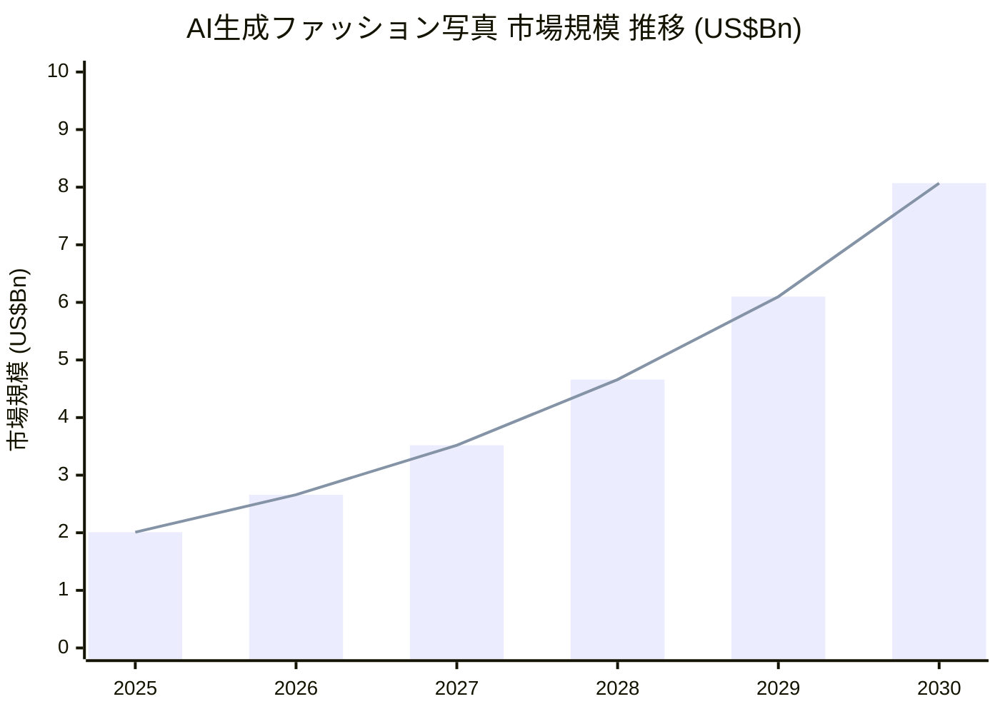

# Executive Summary — AI × 伝統モデルエージェンシーという空白

> 渡辺真史 様へのご相談 / 2026-04-21
> 株式会社TomorrowProof 代表 KOZUKI TAKAHIRO

---

## 背景 — カテゴリは 2026 年に立ち上がった

AIモデルエージェンシーというカテゴリは、**2026年に入ってから海外で本格的に立ち上がりつつある** 新領域です。

- **H&M** — 2025年3月、所属モデルの「デジタルツイン」30体を作成する計画を発表。モデル本人が自身のデジタル肖像権を保有し、他ブランドにライセンスできるモデルを採用([CNN 2025-03-28](https://www.cnn.com/2025/03/28/style/h-and-m-ai-models-intl-scli))
- **Mango** — 2024年、ティーンズ向けコレクションで AI 100% 生成キャンペーンを公開。以降、継続的にAI素材を広告クリエイティブに活用([BoF 2024-10-31](https://www.businessoffashion.com/news/technology/ai-models-replace-real-people-in-mangos-fast-fashion-ads/))
- **Levi's** — Lalaland.ai(現 Browzwear傘下)と提携し、ECでの多様性拡張を目的にAIモデル実験を継続([LS&Co. 2023-03-22](https://www.levistrauss.com/2023/03/22/lsco-partners-with-lalaland-ai/))
- **EU AI Act §50** — 2026年8月施行の透明性義務により、AI生成素材は「機械可読なマーキング + 視覚的開示」が必須化([EU AI Act Art.50](https://artificialintelligenceact.eu/article/50/))

市場規模(推計):
- AI生成ファッション写真市場 — 2025年 **US$20.1億** → 2030年 **US$80.7億**、CAGR 32.3%([GII Research 2026](https://www.gii.co.jp/report/tbrc1968799-artificial-intelligence-ai-generated-fashion.html))
- AIファッションモデル市場(エージェンシー領域) — 2026年 **US$8.67億** → 2036年 **US$62億**、CAGR 21.7%([OpenPR 2026](https://www.openpr.com/news/4471921/ai-fashion-models-market-size-growth-trends-and-forecast))
- 日本アパレルEC市場 — 2024年度 **2兆7,980億円**、EC化率 23.38%、物販全体(9.78%)の約2.4倍のデジタルシフト([経産省2024年度電子商取引実態調査](https://www.ecbeing.net/contents/detail/578))

> 図 M01: AI生成ファッション写真市場の成長曲線(2025年 → 2030年、US$Bn)

> 出典: GII Research 2026(CAGR 32.3%前提で補間)。2030 年に US$80.7 億 = 約 ¥1.2 兆円規模。

### TAM / SAM / SOM — 市場の階層(素案)

> 図 H01: 参入可能市場の3層構造(日本単独での推計、金額は年間)

<table style="width:100%; border-collapse:collapse;">
  <tr>
    <td style="background:#0A0A0F; color:#00D4FF; border:1px solid #1A1A2E; padding:12px; text-align:center; font-weight:700; font-size:1.1em;">
      TAM — 日本アパレルEC市場全体 
      ¥2.8兆円 
      (経産省 2024年度 電子商取引実態調査)
    </td>
  </tr>
  <tr>
    <td style="background:#0A0A0F; color:#FAFAFA; border:1px solid #1A1A2E; padding:12px; text-align:center; font-weight:600;">
      SAM — 撮影コスト比率 1.5-2% + AI代替可能 70% 
      ¥290-390億円 
      (撮影・モデル・動画領域のうち AI 置換可能な部分)
    </td>
  </tr>
  <tr>
    <td style="background:#0A0A0F; color:#FAFAFA; border:1px solid #00D4FF; padding:12px; text-align:center; font-weight:600;">
      SOM — 10 年後 AIシフト率 30% × Wizard AI シェア 1-3% 
      ¥1.5-18億円 / 年 
      (3C分析 §7 TAM 推計 より)
    </td>
  </tr>
</table>

※ HTMLが崩れる viewer では以下を参照:
- TAM: ¥2.8兆円 / SAM: ¥290-390億円 / SOM: ¥1.5-18億円 / 年(保守推計)

## 機会 — 「伝統エージェンシー × AI」は世界でも未開拓

現在のプレイヤー構図には、**明確な空白**があります。

| 領域 | プレイヤー | 構造的弱み |
|---|---|---|
| AIツール系 | Botika(US), Lalaland(→B2B統合), Deep Agency | 「ツール」であり、**エージェンシーとしてのブランド・顔がない** |
| 日本の低価格AI事務所 | ai-model.jp, ai-admakers.jp(¥10,000/年) | 低品質・IP設計なし・業界信用なし |
| 伝統モデルエージェンシー | IMG / Elite / Ford / Next / DNA / Storm / Wizard | AI対応なし(Storm のみ AI Code of Practice) |

→ **「伝統エージェンシーの信用・美学・人脈 × AI技術・IP設計・運営ツール」を組み合わせたプレイヤーは、現状どこにも存在しません。**

日本の事例(imma / Aww Inc.)は ”バーチャルヒューマンIP” の方向で、**ファッションエージェンシーとしての機能 — ロスター管理・ブランド使用権ライセンス・キャンペーン受注** は整備されていません。

### 現状 vs 提案 — 差分マトリクス

> 図 H02: 現状 3 プレイヤー構図と Wizard AI(提案)の差分比較

<table style="width:100%; border-collapse:collapse; font-size:0.9em;">
  <thead>
    <tr style="background:#0A0A0F; color:#FAFAFA;">
      <th style="border:1px solid #1A1A2E; padding:10px; text-align:left;">ケイパビリティ</th>
      <th style="border:1px solid #1A1A2E; padding:10px;">AIツール系 (Botika等)</th>
      <th style="border:1px solid #1A1A2E; padding:10px;">日本低価格AI (ai-admakers等)</th>
      <th style="border:1px solid #1A1A2E; padding:10px;">伝統エージェンシー (IMG/Elite/Wizard)</th>
      <th style="border:1px solid #00D4FF; padding:10px; color:#00D4FF;">Wizard AI (提案)</th>
    </tr>
  </thead>
  <tbody>
    <tr>
      <td style="border:1px solid #1A1A2E; padding:8px;"><strong>業界信用・ブランドの顔</strong></td>
      <td style="border:1px solid #1A1A2E; padding:8px; text-align:center; color:#FF3366;">×</td>
      <td style="border:1px solid #1A1A2E; padding:8px; text-align:center; color:#FF3366;">×</td>
      <td style="border:1px solid #1A1A2E; padding:8px; text-align:center; color:#00FF88;">◎</td>
      <td style="border:1px solid #00D4FF; padding:8px; text-align:center; color:#00FF88; background:#0A0A0F;"><strong>◎</strong></td>
    </tr>
    <tr>
      <td style="border:1px solid #1A1A2E; padding:8px;"><strong>AI技術・生成パイプライン</strong></td>
      <td style="border:1px solid #1A1A2E; padding:8px; text-align:center; color:#00FF88;">◎</td>
      <td style="border:1px solid #1A1A2E; padding:8px; text-align:center; color:#FFB800;">△</td>
      <td style="border:1px solid #1A1A2E; padding:8px; text-align:center; color:#FF3366;">×</td>
      <td style="border:1px solid #00D4FF; padding:8px; text-align:center; color:#00FF88; background:#0A0A0F;"><strong>◎</strong></td>
    </tr>
    <tr>
      <td style="border:1px solid #1A1A2E; padding:8px;"><strong>Character Bible / IP設計</strong></td>
      <td style="border:1px solid #1A1A2E; padding:8px; text-align:center; color:#FFB800;">△</td>
      <td style="border:1px solid #1A1A2E; padding:8px; text-align:center; color:#FF3366;">×</td>
      <td style="border:1px solid #1A1A2E; padding:8px; text-align:center; color:#FFB800;">△(人間のみ)</td>
      <td style="border:1px solid #00D4FF; padding:8px; text-align:center; color:#00FF88; background:#0A0A0F;"><strong>◎(14体完備)</strong></td>
    </tr>
    <tr>
      <td style="border:1px solid #1A1A2E; padding:8px;"><strong>EU AI Act §50 対応</strong></td>
      <td style="border:1px solid #1A1A2E; padding:8px; text-align:center; color:#FFB800;">△</td>
      <td style="border:1px solid #1A1A2E; padding:8px; text-align:center; color:#FF3366;">×</td>
      <td style="border:1px solid #1A1A2E; padding:8px; text-align:center; color:#FF3366;">×</td>
      <td style="border:1px solid #00D4FF; padding:8px; text-align:center; color:#00FF88; background:#0A0A0F;"><strong>◎</strong></td>
    </tr>
    <tr>
      <td style="border:1px solid #1A1A2E; padding:8px;"><strong>日本語 + 国際ブランド対応</strong></td>
      <td style="border:1px solid #1A1A2E; padding:8px; text-align:center; color:#FFB800;">△</td>
      <td style="border:1px solid #1A1A2E; padding:8px; text-align:center; color:#FFB800;">△</td>
      <td style="border:1px solid #1A1A2E; padding:8px; text-align:center; color:#00FF88;">◎</td>
      <td style="border:1px solid #00D4FF; padding:8px; text-align:center; color:#00FF88; background:#0A0A0F;"><strong>◎</strong></td>
    </tr>
    <tr>
      <td style="border:1px solid #1A1A2E; padding:8px;"><strong>価格</strong></td>
      <td style="border:1px solid #1A1A2E; padding:8px; text-align:center;">中($22/月〜)</td>
      <td style="border:1px solid #1A1A2E; padding:8px; text-align:center;">極安(¥10,000/年)</td>
      <td style="border:1px solid #1A1A2E; padding:8px; text-align:center;">超高(月¥24-70万)</td>
      <td style="border:1px solid #00D4FF; padding:8px; text-align:center; color:#00D4FF; background:#0A0A0F;"><strong>中(¥5,000〜)</strong></td>
    </tr>
  </tbody>
</table>

※ HTMLが崩れる viewer では、**Wizard AI だけが全項目で ◎(+ 中価格帯)** という構造 = ブルーオーシャンに位置することのみ押さえてください。

## ご相談 — Wizard AI(仮称)の共同構想

渡辺様のもとで、新しい事業の形をご一緒できないかというご相談です。

**素案の骨子:**

- Wizard Models 様の新事業部、あるいは姉妹ブランドとして **「Wizard AI」(仮称、ネーミングは渡辺様に一任)** を立ち上げる
- **既存の Wizard Models 顧客には一切触れない。** 新規ルート(EC・D2C・海外ブランド・芸能)のみを対象とする
- **顔・信用・クリエイティブ方向性** を渡辺様に担っていただき、**技術・IP・運営・マーケ** を私(KOZUKI)が担当する
- ロスターは **LUMINA で構築済みの AI モデル14体(Character Bible完備)+ Wizard Models の人間モデル(希望者)** のハイブリッド構造
- 初期はクリエイティブ生成委託・HP制作・AI キャンペーン等を幅広く受注し、サービスの幅を持ちながら立ち上げる
- BEDWIN でのAIモデル活用や、他ブランドとの共創も、事業が走り出す中で自然に組み込む

## 私(KOZUKI)の姿勢 — giver として入ります

事業立ち上げの **実費(サーバー・API・制作費等)** を除き、**固定報酬は設けない前提** でお考えください。

- 私は技術と時間を提供します
- 事業が立ち上がり、キャッシュが回るようになってから、**事業運営コストに業務委託として必要分を乗せる** 形で、自然に整える姿勢です
- 金銭条件より、**「この事業を渡辺様と立ち上げる」こと自体に価値がある** と考えております
- 具体的な数字の設計は、事業の初期成果が出た段階で改めてご相談させてください

## ご依頼内容 — 30分の対話

このドキュメントは、あくまで論点整理の素案です。**渡辺様が AI というテクノロジーとどう関わりたいか、もしくは "こういうことならやりたい" という方向性** を伺うことが、初回対話の主目的です。

**Google Meet URL:** https://calendar.app.google/4EPiRfG5wYjJfn4J6

---

**参照:**
- `docs/legal/character-bibles/` — AIモデル14体の IP 仕様書
- `docs/pricing/pricing-rationale.md` — 料金体系の論理的根拠
- `docs/design/seo-strategy.md` — SERP 競合調査(2026-04-19)
- `journal/2026/04/19.md` — 伝統Top8エージェンシー調査サマリー
