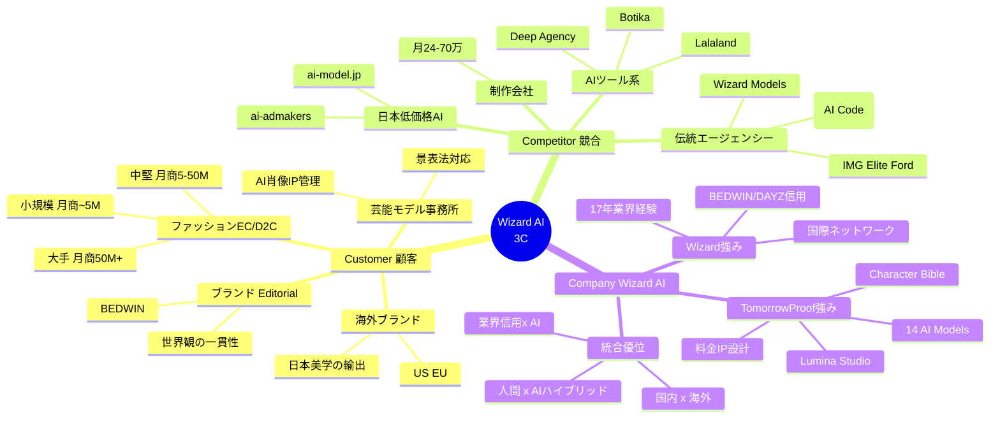
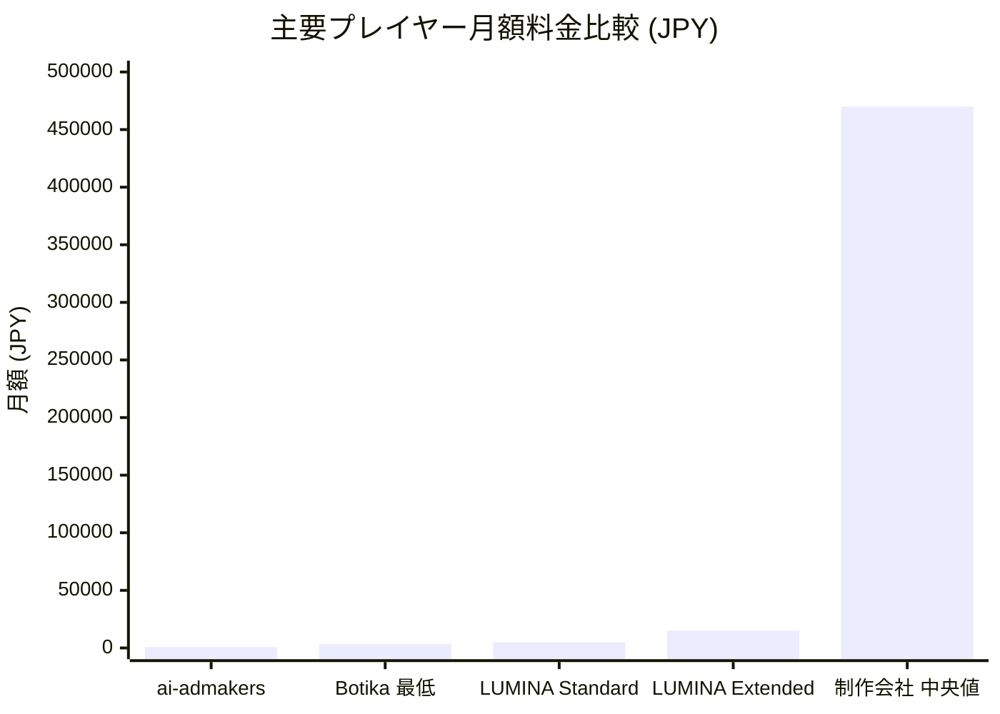
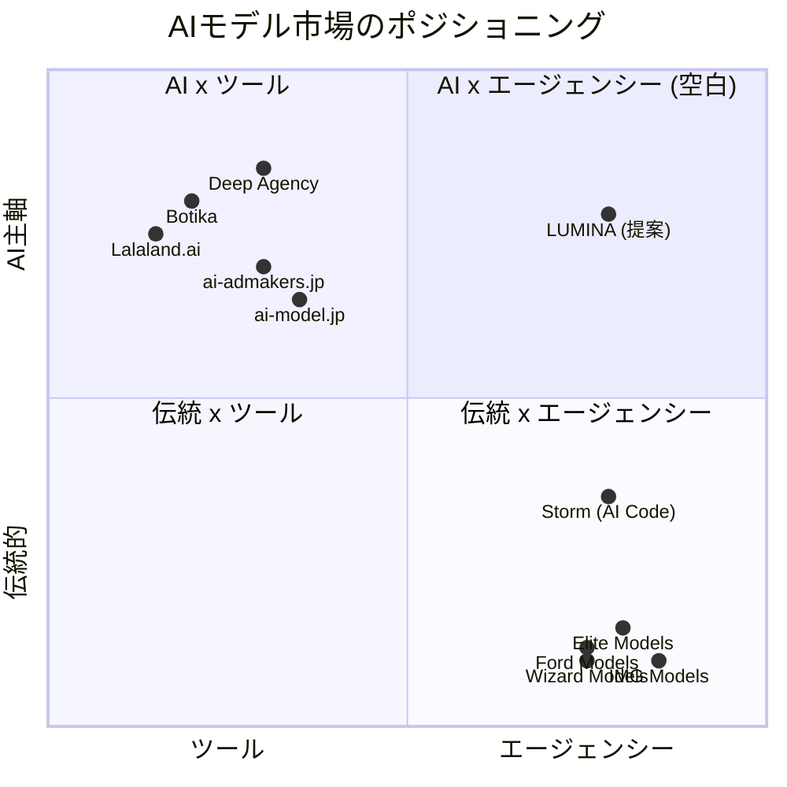

# 02. Market 3C Analysis — Customer / Competitor / Company

> 渡辺真史 様へのご相談素案 / 2026-04-21

本章では、Wizard AI(仮称) が対象とする市場を Customer / Competitor / Company の3角度から整理しております。数値には推計を含みますので、その旨を明示しております。

> 図 M04: 3C分析 全体マップ



---

## 1. Customer — 誰の、どの痛みに応えるか

AIモデルエージェンシーの需要は、以下の4つのセグメントに分布していると考えております。

### 1-1. ファッションEC / D2C(コア層)

| 規模 | 月商 | ペイン | 月あたりの撮影コスト(推計) |
|---|---|---|---|
| 小規模D2C | ~¥5M | 撮影予算が捻出できない / モデル確保が難しい | ¥140k-330k ([lumina-studio-lp](https://lumina-studio-lp.vercel.app/)) |
| 中堅D2C | ¥5M-50M | SKU回転が撮影に追いつかない | ¥400k-1M |
| 大手アパレル | ¥50M+ | シーズン撮影コスト・モデル交渉・海外撮影の複雑性 | ¥1M-5M+ |

**日本のアパレルEC市場規模 2024年度: 2兆7,980億円**、EC化率 23.38%([経産省2024年度電子商取引実態調査](https://www.ecbeing.net/contents/detail/578))。
うち中堅以下のプレイヤー(全体の約60%推計)が、撮影コストの問題を常に抱えている、というのが Lumina の顧客ヒアリングから見えている実態です。

### 1-2. 芸能・モデル事務所(新規セグメント)

- タレントの AI 肖像権 IP 管理のニーズが急拡大(H&M が 30体のデジタルツイン作成を発表、モデル本人が肖像権を保持する構造)([CNN 2025-03-28](https://www.cnn.com/2025/03/28/style/h-and-m-ai-models-intl-scli))
- 日本では Aww Inc.(imma)が「バーチャルヒューマンIP」で先行。ただし **「事務所の既存タレントの AI 肖像を管理・ライセンスするSaaS/エージェンシー」は空白** ([Aww Inc.](https://aww.tokyo/en/))
- 2023年10月〜の景品表示法改正で、バーチャル・AI 問わずステマ規制対象となり、**「法務的に守られた AI 肖像運用」の需要が顕在化**

### 1-3. 海外ブランド(渡辺様の国際的ネットワークが活きる層)

- US / EU ブランドは H&M / Mango / Levi's を皮切りに AI モデル活用を本格化
- 日本のブランド感性・クラフトマンシップを求める欧米ブランドは継続的にあり、**日本のAIエージェンシーから欧米ブランドにクリエイティブを提供する逆流動線** は未開拓
- EU AI Act 2026年8月施行で「透明性を担保したAIクリエイティブ提供者」が選別される流れ([EU AI Act Art.50](https://artificialintelligenceact.eu/article/50/))

### 1-4. ブランド × Editorial(BEDWIN 等、クラフト・世界観重視層)

- 自ブランドの世界観を維持しながら撮影コストを下げたい層
- 「通販用の均質な撮影」ではなく「ブランドの物語を載せられる AI 素材」を求める
- 現状のAIツール(Botika等)は **世界観の一貫性が弱く**、ハイエンド・中堅ブランドが使いにくい
- → BEDWIN / DAYZ のような世界観を持つブランドほど、**Character Bible 方式(モデル1体ごとに設定・美学を固定)** が適合

---

## 2. Competitor — どこに空白があるか

### 2-1. AIツール系(海外)

| プレイヤー | 料金 | 特徴 | 弱み |
|---|---|---|---|
| **Botika** | $22/月〜 | Shopify App、1,000+ ブランド採用、90%コスト削減を自称([Botika](https://botika.com/)) | ツール。エージェンシー性・ブランドの顔なし。日本語UI弱い。キャラクター固定化弱い |
| **Lalaland.ai** | 非公開(B2B統合) | Levi's 提携で知名度。2025-07 Browzwearに買収、一般販売から撤退([FashionNetwork](https://ww.fashionnetwork.com/news/Ai-expands-in-fashion-as-h-m-and-mango-launch-digital-first-initiatives,1745741.html)) | 一般市場から退出、企業向け統合 |
| **Deep Agency** | 非公開 | 撮影代替ツールとしてのポジショニング | エージェンシー機能なし、ロスター概念なし |

**共通弱み**: 「AIで撮影を効率化するツール」であり、**ブランドの顔(=誰が推薦しているか)・エージェンシーの業界信用・ロスターの継続性** を提供していない。

> 図 M03: 競合料金比較(月額換算、¥)



> 注: ai-admakers ¥10,000/年 = 月 ¥833。Botika $22/月 ≒ ¥3,300(1 USD = ¥150 換算)。制作会社は月 ¥24〜70 万のレンジ中央値として ¥47 万。
>
> **帯の「空白」**: ¥5,000 〜 ¥30,000 の「品質 × 継続性」を担保した帯が、Wizard AI のプライシングゾーン。

### 2-2. 日本の低価格AIモデル事務所

| プレイヤー | 料金 | 特徴 |
|---|---|---|
| **ai-admakers.jp** | 年¥10,000/モデル、3年目以降無料([ai-admakers](https://www.ai-admakers.jp/model-agency/)) | 超低価格、大量生成型、品質・IPケア弱い |
| **ai-model.jp** | 非公開 | 広告・EC・SNS向けAIタレントDX支援 |

**共通弱み**: **IP 設計なし(モデルが使い回される)、Character Bible なし(ブランドで継続起用しづらい)、業界人脈なし、ハイエンド訴求なし**。価格で勝ちにいっている領域で、**ブランド格を重視する層とは接点が薄い**。

### 2-3. 伝統モデルエージェンシー(Top8 + 国内)

2026年4月時点の調査([journal/2026/04/19.md](../../../journal/2026/04/19.md)):

| エージェンシー | AI対応 | 特徴 |
|---|---|---|
| IMG / Elite / Ford / Next / Wilhelmina / DNA | なし | 人間モデル専業、AI戦略未発表 |
| **Storm** (London) | あり(AI Code of Practice)([Storm](https://www.stormmanagement.com/)) | 2025にAI透明性ポリシー公開、唯一の"守りの対応" |
| **Wizard Models**(東京) | 未対応 | International / Asian ダブルロスター、渋谷道玄坂拠点、2008年設立([Wizard Models](https://wizardmodels.com/about/)) |

**共通傾向**: 伝統エージェンシーは AI に対し「守り」(reactive)。 **「攻め」(proactive)のハイブリッド戦略を取っているプレイヤーは、世界を見渡してもいない。**

> 図 H03: Top 8 伝統エージェンシー AI対応マトリクス

<table style="width:100%; border-collapse:collapse; font-size:0.9em;">
  <thead>
    <tr style="background:#0A0A0F; color:#FAFAFA;">
      <th style="border:1px solid #1A1A2E; padding:10px; text-align:left;">エージェンシー</th>
      <th style="border:1px solid #1A1A2E; padding:10px;">本拠地</th>
      <th style="border:1px solid #1A1A2E; padding:10px;">AI 戦略</th>
      <th style="border:1px solid #1A1A2E; padding:10px;">対応度</th>
    </tr>
  </thead>
  <tbody>
    <tr>
      <td style="border:1px solid #1A1A2E; padding:8px;"><strong>IMG Models</strong></td>
      <td style="border:1px solid #1A1A2E; padding:8px;">NYC</td>
      <td style="border:1px solid #1A1A2E; padding:8px;">未発表</td>
      <td style="border:1px solid #1A1A2E; padding:8px; text-align:center; color:#FF3366;">×</td>
    </tr>
    <tr>
      <td style="border:1px solid #1A1A2E; padding:8px;"><strong>Elite Model World</strong></td>
      <td style="border:1px solid #1A1A2E; padding:8px;">Paris</td>
      <td style="border:1px solid #1A1A2E; padding:8px;">未発表</td>
      <td style="border:1px solid #1A1A2E; padding:8px; text-align:center; color:#FF3366;">×</td>
    </tr>
    <tr>
      <td style="border:1px solid #1A1A2E; padding:8px;"><strong>Ford Models</strong></td>
      <td style="border:1px solid #1A1A2E; padding:8px;">NYC</td>
      <td style="border:1px solid #1A1A2E; padding:8px;">未発表</td>
      <td style="border:1px solid #1A1A2E; padding:8px; text-align:center; color:#FF3366;">×</td>
    </tr>
    <tr>
      <td style="border:1px solid #1A1A2E; padding:8px;"><strong>Next Management</strong></td>
      <td style="border:1px solid #1A1A2E; padding:8px;">NYC</td>
      <td style="border:1px solid #1A1A2E; padding:8px;">未発表</td>
      <td style="border:1px solid #1A1A2E; padding:8px; text-align:center; color:#FF3366;">×</td>
    </tr>
    <tr>
      <td style="border:1px solid #1A1A2E; padding:8px;"><strong>Wilhelmina Models</strong></td>
      <td style="border:1px solid #1A1A2E; padding:8px;">NYC</td>
      <td style="border:1px solid #1A1A2E; padding:8px;">未発表</td>
      <td style="border:1px solid #1A1A2E; padding:8px; text-align:center; color:#FF3366;">×</td>
    </tr>
    <tr>
      <td style="border:1px solid #1A1A2E; padding:8px;"><strong>DNA Model Management</strong></td>
      <td style="border:1px solid #1A1A2E; padding:8px;">NYC</td>
      <td style="border:1px solid #1A1A2E; padding:8px;">未発表</td>
      <td style="border:1px solid #1A1A2E; padding:8px; text-align:center; color:#FF3366;">×</td>
    </tr>
    <tr>
      <td style="border:1px solid #1A1A2E; padding:8px;"><strong>Storm Management</strong></td>
      <td style="border:1px solid #1A1A2E; padding:8px;">London</td>
      <td style="border:1px solid #1A1A2E; padding:8px;">AI Code of Practice(2025)</td>
      <td style="border:1px solid #1A1A2E; padding:8px; text-align:center; color:#FFB800;">△ 守り</td>
    </tr>
    <tr>
      <td style="border:1px solid #1A1A2E; padding:8px;"><strong>Wizard Models</strong></td>
      <td style="border:1px solid #1A1A2E; padding:8px;">Tokyo</td>
      <td style="border:1px solid #1A1A2E; padding:8px;">未発表</td>
      <td style="border:1px solid #1A1A2E; padding:8px; text-align:center; color:#FF3366;">×</td>
    </tr>
    <tr style="background:#0A0A0F;">
      <td style="border:1px solid #00D4FF; padding:10px; color:#00D4FF;"><strong>Wizard AI (本提案)</strong></td>
      <td style="border:1px solid #00D4FF; padding:10px; color:#00D4FF;">Tokyo</td>
      <td style="border:1px solid #00D4FF; padding:10px; color:#00D4FF;">Proactive Hybrid(14 AI ロスター + 人間 + BEDWIN 美学)</td>
      <td style="border:1px solid #00D4FF; padding:10px; text-align:center; color:#00FF88;"><strong>◎ 攻め</strong></td>
    </tr>
  </tbody>
</table>

※ HTMLが崩れる viewer では、要点のみ: **Storm 以外 7社は AI 戦略未発表。Storm も "守り" のみ。Wizard AI だけが "攻め" のハイブリッド構造**。
調査日: 2026-04-19 ([journal/2026/04/19.md](../../../journal/2026/04/19.md))

### 2-4. 制作会社(Production House)

- 従来EC撮影コスト: ¥85-300k/回 × 月数回 = **月¥24-70万** (lumina-studio-lp 顧客ヒアリング)
- 納期: 3-7日/SKU、シーズン撮影は 1-2ヶ月
- クリエイティブ品質は高いが、**コスト・速度で Botika 級の AI ツールに負け始めている**

### 2-5. ポジショニングマップ(X: ツール ←→ エージェンシー、Y: 伝統的 ←→ AI主軸)

> 図 M02: AIモデル市場のポジショニングマップ(Mermaid レンダリング版)



プレーンテキスト版(Mermaid 非対応 viewer 用):

```
                    エージェンシー
                          ▲
                          │
  Wizard Models ●         │            ● Wizard AI(仮称)
  IMG/Elite/Ford          │              ← 空白ポジション
  ───────────────────────┼───────────────────────▶ AI
  (伝統)                   │                       (AI活用)
                          │
                          │           ● Botika
  制作会社 ●              │           ● ai-admakers
                          │           ● Deep Agency
                          ▼
                       ツール
```

**空白の象限 = 「伝統の信用 × AIの技術・速度」を兼ね備えたエージェンシー**。

Storm のみが中間帯(AI Code of Practice で「守りの AI 対応」)にあり、他は極端に分布。Wizard AI のポジションは **世界的にも類例なし**。

---

## 3. Company — Wizard Models × TomorrowProof の combined strength

### 3-1. Wizard Models 様の強み

- **2008年設立、17年の業界経験**([Wizard Models About](https://wizardmodels.com/about/))
- **International + Asian ロスター** の並行運用 — 国内外ブランド双方に対応可能
- **渡辺様の業界ネットワーク** — BEDWIN(2004〜) / DAYZ(ミヤシタパーク) / HYPEGOLF / Tiffany × Numéro Tokyo コラボ等([HYPEBEAST JP](https://hypebeast.com/jp/2021/5/masafumi-watanabe-bedwin-inteview-hypegolf), [Numéro TOKYO](https://numero.jp/tiffany/story04.html))
- **業界の "顔" としての信用** — ラグジュアリー、ストリート、スポーツ、ジュエリーを越境する稀有なポジション

### 3-2. TomorrowProof(KOZUKI)の提供できるもの

- **AIモデル IP 14体** — Character Bible 完備、各モデルに詳細な設定・美学・使用範囲を定義済み([docs/legal/character-bibles](../../../docs/legal/character-bibles/))
  - 女性: ELENA / AMARA / SOFIA / NADIA / MIKU / HARIN / LIEN / RINKA
  - 男性: IDRIS / LARS / MATEO / SHOTA / JIHO / RYO / LUCAS MORI / KAI
- **生成パイプライン** — Lumina Studio(画像) + Video Studio(動画)が稼働中。Gemini 3 Pro Image Preview + Replicate(Kling/Seedance)+ ElevenLabs を統合
- **料金・IP ライセンス設計** — Standard / Extended / Campaign / Exclusive の4 tier、特商法・EU AI Act §50 対応済み([docs/pricing/pricing-rationale.md](../../../docs/pricing/pricing-rationale.md))
- **運営・マーケ** — Vercel / Supabase / Stripe / freee の運用環境、SNS運用体制、広告運用(Google広告)
- **ファッションディレクターのバックグラウンド** — AI 画像の品質判定を自分で下せる(撮影経験の延長)

### 3-3. 組み合わせによる唯一性

| 要素 | Wizard 単独 | TomorrowProof 単独 | **Wizard AI(仮称)** |
|---|---|---|---|
| 業界信用 | ◎ | △ | **◎** |
| AI技術 | × | ◎ | **◎** |
| Character IP | × | ◎ | **◎** |
| 国際ネットワーク | ◎ | ○ | **◎** |
| 運営・マーケ | ○ | ◎ | **◎** |
| クリエイティブ方向性 | ◎ | ○ | **◎** |

→ 業界唯一の **"Hybrid Agency"** (伝統 × AI、人間 × AIモデル、日本 × 海外)。

---

## 4. 数値データの出典と留意点

- 経産省 電子商取引実態調査(2024年度) — ebeing/ebisumart/ec-cube等の業界メディア経由で引用
- GII Research / OpenPR — 市場規模は推計値であり、調査機関により幅あり
- 人間モデル撮影相場 — 国内プロダクション非公開料金表の業界平均推計、幅を持って記載
- 競合料金 — Botika公式 / ai-admakers公式(2026-04時点確認)
- Lumina 自社コスト試算 — [pricing-rationale.md](../../../docs/pricing/pricing-rationale.md) 参照、生成コストは実測・顧客データは想定値

---

**次章**: [`03-opportunity-landscape.md`](03-opportunity-landscape.md) — 機会分析(市場立ち上がり、海外・芸能展開)
