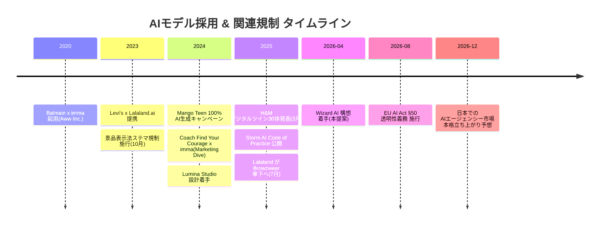
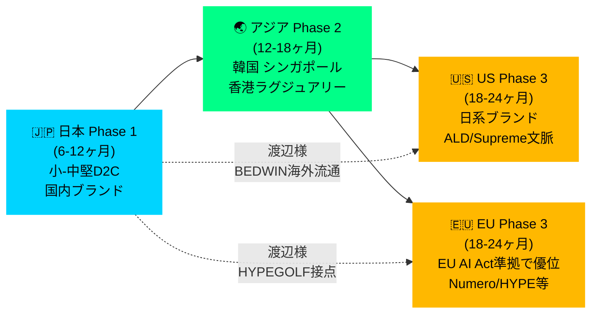
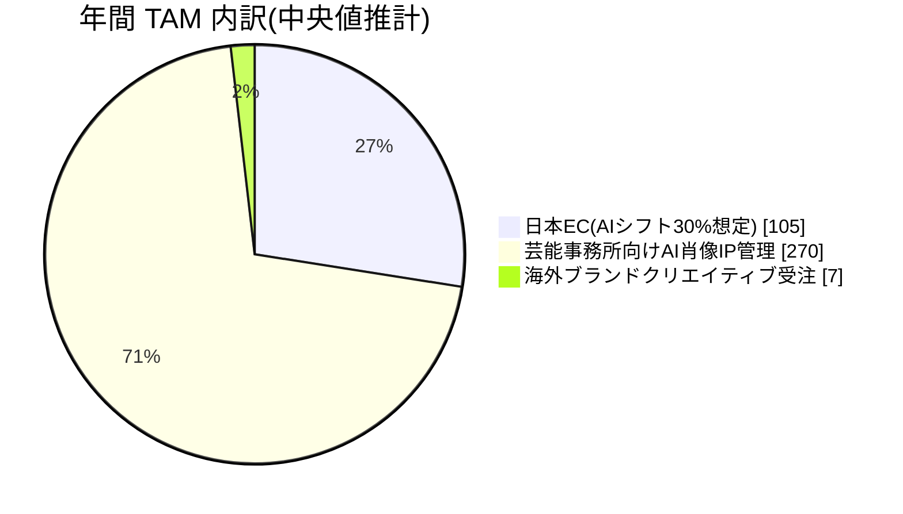

# 03. Opportunity Landscape — なぜ今、なぜ日本発で海外を狙えるか

> 渡辺真史 様へのご相談素案 / 2026-04-21

---

## 1. 日本のファッションEC市場 — 撮影コストは構造的ペイン

### 1-1. 市場規模

- **2024年度アパレルEC市場: 2兆7,980億円**(経産省電子商取引実態調査、前年比 +4.74%)
- **EC化率 23.38%** — 物販全体(9.78%)の2.4倍進んでいる
- 中堅〜小規模プレイヤー(月商 ¥10M以下)が全体の約60%を占める(推計)

出典: [経産省2024年度電子商取引実態調査](https://www.ecbeing.net/contents/detail/578)

### 1-2. 撮影コストの現実

中堅D2Cの典型的な撮影オペレーション(Luminaの顧客ヒアリングから):

| 項目 | コスト / 時間 |
|---|---|
| 1撮影あたり(モデル / フォトグラファー / スタイリスト) | ¥150,000-300,000 |
| 月あたり撮影回数(月20-30SKU回転) | 5-10回 |
| **月あたり撮影予算** | **¥0.8M-3M** |
| 企画〜納品のリードタイム | **3-7日/SKU、シーズン撮影 1-2ヶ月** |

→ **年間撮影予算 ¥10M-36M** が、中堅アパレルECの固定コスト帯。

### 1-3. 削減効果(LUMINA 試算)

Lumina Extended tier(¥15,000/月、画像300枚 + 動画10本/月含む)で同等のアウトプットを生成した場合:

| | 従来 | LUMINA Extended |
|---|---|---|
| 年間コスト | ¥36M | ¥180,000 |
| **削減率** | | **99.5%** |
| 納期 | 3-7日/SKU | 24時間以内/SKU |

出典: [pricing-rationale.md §5](../../../docs/pricing/pricing-rationale.md)

---

## 2. AIファッションモデル市場の立ち上がり — 2026年が転換点

### 2-1. グローバル市場規模

複数調査機関の推計:

| ソース | 2025年 | 2026年 | 2030年 | CAGR |
|---|---|---|---|---|
| GII Research(AI生成ファッション写真) | $2.01B | $2.66B | $8.07B | **32.3%** |
| OpenPR(AIファッションモデル、エージェンシー領域) | $0.70B | $0.87B | $6.2B(2036年) | **21.7%** |
| Business Research Insights(AI in Fashion 全体) | $1.75B | $2.47B | $12.5B | **40.8%** |

出典:
- [GII Research 2026](https://www.gii.co.jp/report/tbrc1968799-artificial-intelligence-ai-generated-fashion.html)
- [OpenPR 2026](https://www.openpr.com/news/4471921/ai-fashion-models-market-size-growth-trends-and-forecast)
- [Business Research Company](https://www.thebusinessresearchcompany.com/report/ai-in-fashion-global-market-report)

### 2-2. 海外ブランドの採用事例(2024-2025)

AI モデル活用は、2024年後半から **グローバル大手の公式採用フェーズ** に入りました。

> 図 M07: 主要ブランド採用・規制施行の時系列(2020 → 2026-08)



| ブランド | 採用内容 | 時期 | 出典 |
|---|---|---|---|
| **Mango** | Teen ラインで 100% AI生成キャンペーン | 2024-10 | [BoF](https://www.businessoffashion.com/news/technology/ai-models-replace-real-people-in-mangos-fast-fashion-ads/) |
| **H&M** | 所属モデル30体のデジタルツインを作成、本人が肖像権保有 | 2025-03 | [CNN](https://www.cnn.com/2025/03/28/style/h-and-m-ai-models-intl-scli) |
| **Levi's** | Lalaland.ai と提携、ECで多様性拡張 | 2023-03〜 | [LS&Co.](https://www.levistrauss.com/2023/03/22/lsco-partners-with-lalaland-ai/) |
| **Balmain** | 2020年から imma(Aww Inc.)起用 | 2020〜 | [Aww Inc.](https://aww.tokyo/en/vhuman/imma-en/) |
| **Coach** | 2024年 "Find Your Courage" キャンペーンで imma 起用 | 2024 | [Marketing Dive](https://www.marketingdive.com/news/coach-virtual-influencer-lil-nas-x-imma-gen-z-campaign/707623/) |

### 2-3. Botika の実績データ(コスト削減の裏付け)

- 顧客ブランドは撮影コスト **90% 削減**、市場投入速度 **3倍** を実現
- CTR **+150%**、コンバージョン改善
- 2024-2025年で売上 **9倍**、顧客数 **11倍**
- 現在 US/EU で **1,000+ ブランド採用**

出典: [Botika](https://botika.com/)、[Seedcamp](https://seedcamp.com/views/botika-launches-ai-generated-fashion-model-mobile-app-with-8m-in-seed-funding/)

---

## 3. 法規制の追い風 — EU AI Act §50 (2026-08 施行)

### 3-1. 何が起こるか

2026年8月、EU AI Act の透明性規則が施行され、以下が **EU 内で販売する全ブランドに義務化** されます。

- AI生成または AI大幅編集されたキャンペーン素材は、**視覚的開示 + メタデータレベルのマーキング** が必須
- ディープフェイクは **「EU共通アイコン」** で識別可能にする必要がある
- 素材提供者(=AIエージェンシー側)が、マーキング技術の実装責任を負う

出典: [EU AI Act Article 50](https://artificialintelligenceact.eu/article/50/)、[Jones Day 2026-01](https://www.jonesday.com/en/insights/2026/01/european-commission-publishes-draft-code-of-practice-on-ai-labelling-and-transparency)

### 3-2. 競争優位の構造変化

施行後、ブランド側は以下の選別を始めます:

- **コンプライアンス対応が明文化されたエージェンシー** のみと取引
- Character Bible / Ethics Code / マーキング対応の **3点セット** を持たないプロバイダは選から外れる

→ **Lumina の既存設計はこれらをすべてカバー済み**([docs/design/seo-strategy.md](../../../docs/design/seo-strategy.md)内 ethics 章)。Wizard AI にそのまま移植可能。

---

## 4. 芸能・モデル事務所のAI受容(日本)

### 4-1. 既存の AIタレント事例

- **Aww Inc.(imma)** — 2018年リリース、Porsche Japan / IKEA / Dior / PUMA / Valentino / Calvin Klein / Coach 等と協業、2024年 NVIDIA提携で対話型AIへ進化([Aww](https://aww.tokyo/en/))
- **伊藤園 CM** — AIタレント起用で話題化([aismiley](https://aismiley.co.jp/ai_news/what-is-aitalent-ex/))
- 一方、**大手芸能事務所による自社タレントの AI 肖像管理サービス** は現時点で日本に未登場

### 4-2. 規制対応状況

- 2023-10 改正景品表示法 — ステマ規制により「広告明示 + 責任所在明確化」が全インフルエンサー対象に
- 芸能事務所は **AI肖像権管理・ライセンス運用の内製化コスト** に直面
- → **「事務所向けに AI 肖像 IP を管理・販売する SaaS / エージェンシー」** は巨大な空白セグメント

---

## 5. 海外展開のポテンシャル

### 5-1. なぜ日本発で欧米を狙えるか

- **美学の輸出力** — BEDWIN / visvim / sacai / Aimé Leon Dore(日系クラフトのリスペクト) の文脈は欧米で確立されたブランド資産
- **Character IP ノウハウ** — 日本はキャラクターIPビジネス(アニメ・ゲーム・VTuber)の世界的リーダー。AIモデルの IP 化は日本の得意領域の延長
- **コスト競争力** — 日本の AIサービス価格は欧米の 30-50% 帯で成立させやすい(人件費・オフィスコストの差)

### 5-2. 渡辺様のネットワーク活用

- BEDWIN の海外流通(北米 / EU のセレクトショップ経由)
- DAYZ / HYPEGOLF を通じた HYPEBEAST グローバル編集部との接点
- Tiffany × Numéro TOKYO コラボに象徴される、ラグジュアリー領域でのクロスオーバー実績

→ **"日本発 AI エージェンシーが欧米ブランドにクリエイティブを提供する逆流動線"** を、渡辺様の国際的信用の傘下で構築できる。

> 図 M06: 海外展開 Phase フロー(日本 → アジア → US/EU)



---

## 6. Hybrid Agency のユニークネス

### 6-1. 世界に類例がない理由

| 参入障壁 | 詳細 | Wizard AI の立場 |
|---|---|---|
| 業界信用 | 新興AI企業には時間で買えない | Wizard Models の 17年 + 渡辺様の創業者としての信用 |
| AI技術 | 伝統エージェンシーには技術チームがない | TomorrowProof が持ち込み |
| IP設計 | 既存AIツールは素材生成のみ、Character Bible / tier 設計なし | Lumina 側で設計済み |
| クリエイティブ方向性 | 均質AIツールでは世界観が作れない | 渡辺様の美学をクリエイティブディレクションに |
| 法規制対応 | EU AI Act §50 対応は技術実装が必要 | Lumina 側で準備済み、移植可能 |

### 6-2. ハイブリッド構造の例

```
        人間モデル(Wizard既存)         AIモデル(LUMINA 14体)
               │                              │
               └──────────┬───────────────────┘
                          ▼
              Wizard AI ロスター(ハイブリッド)
                          │
        ┌─────────────────┼──────────────────┐
        ▼                 ▼                  ▼
     EC / D2C        芸能事務所          海外ブランド
   (撮影代替)       (AI 肖像 IP)        (Campaign)
```

---

## 7. Total Addressable Market(TAM)推計 — 複数角度から

### 7-1. 日本国内(ボトムアップ)

- アパレルEC市場 **¥2.8兆円** のうち、撮影コスト比率 **約 1.5-2%** = **¥420-560億円**
- うち AI 代替可能な領域(写真素材・モデル・動画) **約 70%** = **¥290-390億円**
- 10年後にAIシフト率 **30%** 到達と仮定 = **¥90-120億円** の AI ファッション市場(日本単独)

### 7-2. 芸能事務所向け AI 肖像 IP 管理(推計)

- 日本の芸能事務所数: 約3,000社(業界団体推計)
- うちモデル・タレント事務所: 約500-800社
- 平均所属数 20名 × 半数が AI 肖像 IP 管理を求める = **5,000-8,000 IP**
- 1 IP あたり月額 ¥10,000-50,000 × 12ヶ月 = **年¥60-480億円**

### 7-3. 海外ブランド向けクリエイティブ受注

- グローバル AIファッション市場 2026 **US$2.47B**(約¥370億円) / 40.8% CAGR
- 日本発エージェンシーがシェア **1-3%** を 5年以内に取れれば **¥3.7-11億円/年**

### 7-4. TAM 合算(保守推計)

**日本 + 海外 + 芸能 = 年間 ¥150-600億円帯** の市場。

小さくないが、過剰に膨らませる数字でもない。**Wizard AI が 1-3% を取れれば、年商 ¥1.5-18億円** のビジネスとして成立する規模感。

> 図 M05: 年間 TAM の内訳(保守推計、中央値ベース、単位: 億円)



> 注: 日本EC = ¥90-120億円 の中央値 ¥105 億。芸能 = ¥60-480 億円 の中央値 ¥270 億。海外 = 日本発シェア 1-3% × 市場規模(¥370億円)の想定値 ¥7 億。
>
> 3 セグメント合計 = **¥380 億円帯(中央値)**。このうち Wizard AI が 1-3% = **¥3.8-11.4 億円 / 年** の獲得を目指す現実的な射程。

---

## 8. この機会を逃したら何が起こるか

- 2026年後半〜2027年にかけて、**H&M・Mango ライクの AI活用がアジア市場にも広がる**
- 先行しているのは Botika(US)、Aww(日本、ただしエージェンシー機能なし)の2社のみ
- ここ1年以内に **「伝統エージェンシー + AI」型のハイブリッドプレイヤー** が他国から現れる可能性が高い(特に欧州 Storm 周辺)
- 渡辺様のような信用と美学を持つ方と組める窓は、今後長くは空いていないと考えております

---

**次章**: [`04-proposed-structure.md`](04-proposed-structure.md) — 組織構造と役割の素案
