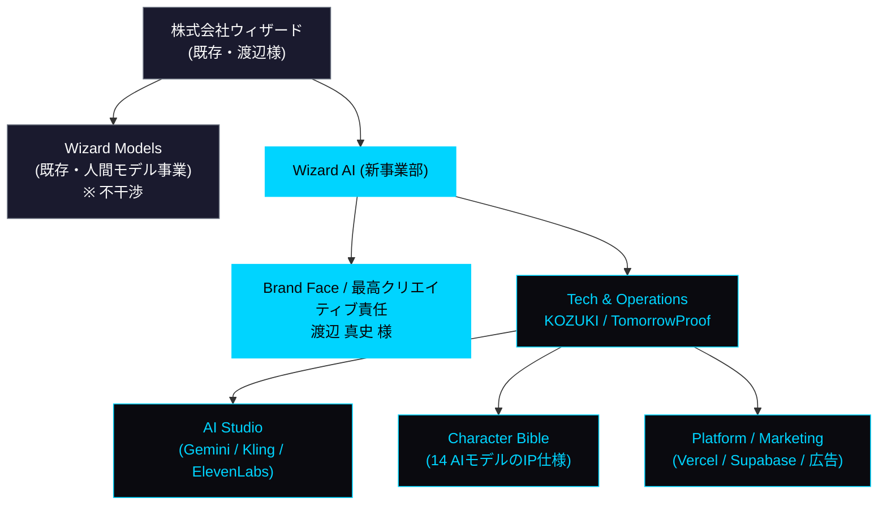
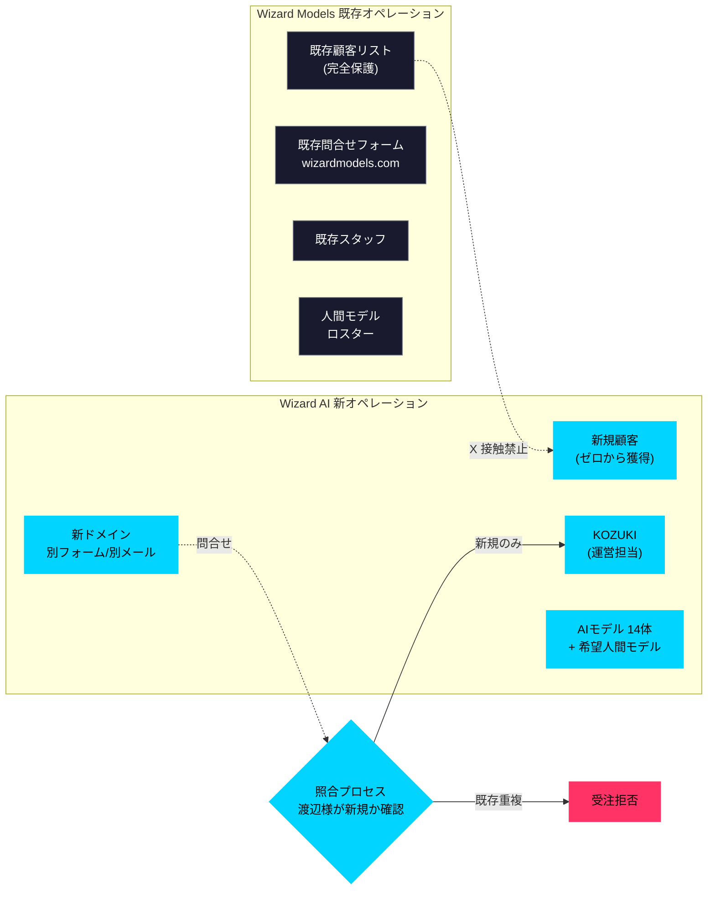
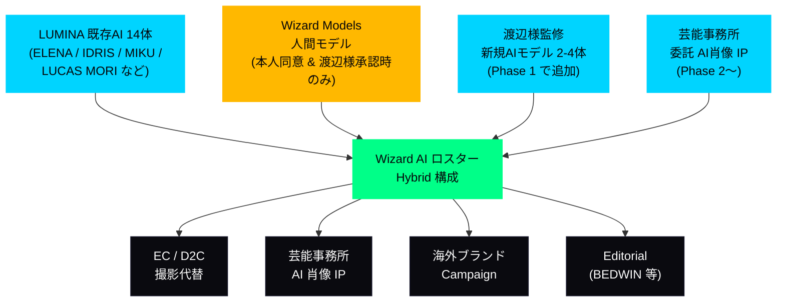
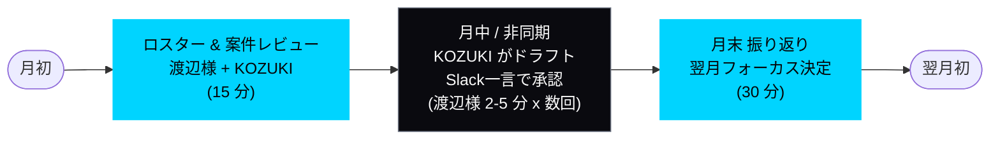

# 04. Proposed Structure — 組織構造と役割の素案

> 渡辺真史 様へのご相談素案 / 2026-04-21
> ※ 組織形態・名称・数字はすべて **たたき台** です。渡辺様のご意向で再設計いただくことを前提にしております。

---

## 1. 組織の位置づけ(案)

### 1-1. Option A — Wizard Models の新事業部 "Wizard AI"

> 図 M08: Wizard AI 組織図(Option A 推奨案)



プレーンテキスト版:

```
株式会社ウィザード(既存)
├── Wizard Models(既存)        ← 既存の国際・アジア人間モデル事業
└── Wizard AI(新設事業部)      ← 新規AI領域、既存顧客と動線分離
```

- メリット: Wizard Models の信用・オフィス・法人格を最短で活用できる
- 渡辺様の事業構造にご負担が少ない
- 既存ロスター・既存顧客を **物理的・契約的に完全分離** 可能

### 1-2. Option B — 別法人 "Wizard AI Inc."(仮)

```
株式会社ウィザード         株式会社TomorrowProof
     │                             │
     └──────────┬──────────────────┘
                ▼
        Wizard AI Inc.(新設合弁会社)
```

- メリット: 出資比率・意思決定構造を明示できる、将来の資本調達に有利
- デメリット: 設立コスト・期間(2-3ヶ月)・法務作業

### 1-3. Option C — Wizard Models のサブブランド(最軽量)

```
Wizard Models
  └── "Wizard AI" (サブブランド、別サイト、別銀行口座は作らない)
```

- メリット: 最速で立ち上がる(1-2週間)、法務負担が最小
- デメリット: 将来スケール時に再構築が必要

**→ たたき台としては Option A を推奨、最終判断は渡辺様に。**
※ どの形態でも、**TomorrowProof は技術・運営提供者** としての立場を取り、**既存 Wizard Models の資本・経営には関与しない** 前提です。

---

## 2. 役割分担(素案)

### 2-1. 渡辺様(Wizard AI 顔・最高クリエイティブ責任者)

- **ブランドの顔・業界への発信者** — 「Wizard AI は渡辺真史が手掛ける」という事実が最大の差別化要因
- **クリエイティブディレクション** — ロスター方向性、キャンペーン美学、ブランドトーンの最終承認
- **業界ネットワークの窓口** — 新規顧客紹介、海外ブランドコラボの opening door
- **既存 Wizard Models との境界管理** — 「既存顧客に絶対触らない」の遵守確認

### 2-2. KOZUKI(TomorrowProof / 運営・技術統括)

- **技術開発・運営** — AI生成パイプライン、プラットフォーム、IP管理システム
- **マーケ・営業** — Web広告、SEO、コンテンツ、営業ファネル設計
- **顧客オペレーション** — 案件受注、制作ディレクション、納品、請求管理
- **法務・コンプライアンス対応** — EU AI Act §50、特商法、IPライセンス契約
- **ファッションディレクター視点での品質判定** — AI出力がブランドレベルに到達しているかの第一段ジャッジ

### 2-3. 業務分担マトリクス

| 領域 | 渡辺様 | KOZUKI | 外部パートナー |
|---|---|---|---|
| ブランド顔・広報 | **主** | 補 | PR会社(必要時) |
| クリエイティブ方向性 | **主** | 補 | — |
| 新規顧客紹介 | **主** | 補 | 営業代行(将来) |
| AI制作・パイプライン | — | **主** | — |
| Webサイト・運営 | — | **主** | 外注ディレクション |
| 法務・契約 | 承認 | **主** | 弁護士(案件発生時) |
| 財務・請求 | 承認 | **主** | freee顧問税理士 |
| 既存Wizard顧客管理 | **既存通り** | 不干渉 | — |
| AIモデルIP 管理 | 方向性承認 | **主** | — |
| 海外ブランド窓口 | **主** | 補(技術対応) | — |
| 芸能事務所窓口 | **主** | 補 | — |

---

## 3. 既存顧客・ブランド不干渉の原則

**これは本プロジェクトの絶対条件として、契約書にも明記したいと考えております。**

### 3-1. 具体的な分離策

| 項目 | Wizard Models(既存) | Wizard AI(新規) |
|---|---|---|
| 顧客リスト | 既存のまま、完全保護 | ゼロから新規獲得 |
| 案件受注ルート | 既存営業・問合せフォーム | 別ドメイン / 別フォーム / 別メールアドレス |
| ロスター | 人間モデル(既存) | AIモデル 14体 + 希望する人間モデル(合意者のみ) |
| 契約・請求 | 既存経理フロー | 新設(or 別会計科目) |
| 担当者 | 既存 Wizard スタッフ | KOZUKI + 必要に応じ追加採用 |
| SNS / Web | 既存サイト | 新設サイト(渡辺様承認) |

> 図 M09: 既存顧客不干渉 — 技術的 & 契約的分離の全体像



**最重要のガード**: 全案件は **受注前に渡辺様の照合を通す** ことで、既存顧客との接触事故を物理的に排除。

### 3-2. 既存 Wizard モデル本人の肖像は扱わない(初期)

- 初期は **既存 Wizard 所属モデルの AI 肖像は一切扱わない** 方針を提案します
- 将来、モデル本人が希望し、渡辺様と合意した場合のみ、**H&M型のデジタルツインIP構造**(モデル本人が肖像権保有、ライセンス料が本人に還元)で慎重に進める
- 無断で既存モデルの顔を AI に学習させることは絶対に行わない

---

## 4. ロスター構造(素案)

### 4-1. 初期ロスター(Lumina 提供 14体)

| カテゴリ | モデル | Character Bible 完備 |
|---|---|---|
| Women Signature | ELENA / AMARA / SOFIA / NADIA | [character-bibles/](../../../docs/legal/character-bibles/) |
| Women Asian | MIKU / HARIN / LIEN | 同上 |
| Women Creator | RINKA | 同上 |
| Men Signature | IDRIS / LARS / MATEO | 同上 |
| Men Asian | SHOTA / JIHO / KAI | 同上 |
| Men Street | RYO / **LUCAS MORI** | 同上(LUCAS MORI は BEDWIN muse としての設定) |

※ LUCAS MORI の Character Bible は、BEDWIN 26SS / Masafumi Watanabe 様のクリエイティブを muse 設定としてつくっております。正式に合流いただける場合、渡辺様の監修を反映して再設計いたします。

### 4-2. 拡張可能な構造

- **Phase 1(3-6ヶ月)**: 14体 + α(渡辺様監修で新規2-4体追加)
- **Phase 2(6-12ヶ月)**: 海外向けサブロスター、芸能事務所からの委託IP
- **Phase 3(12ヶ月〜)**: カテゴリ別独占ブランドコラボライン、動画インフルエンサー型IP

> 図 M10: Hybrid Roster 構成 — AI + 人間モデルの並行運用



---

## 5. クリエイティブ方向性の共創プロセス(素案)

### 5-1. 月次サイクル

```
月初(15分):  渡辺様と KOZUKI でロスター状況 + 案件状況レビュー
月中(非同期): 新規案件の方向性を KOZUKI がドラフト → 渡辺様に Slack / Discord で確認
月末(30分):  月次振り返り + 翌月フォーカス決定
```

→ **渡辺様の拘束時間は月60分以内** を前提として設計します。
過負荷にならないよう、**判断の80%は KOZUKI 側で下し、20%のみ渡辺様の確認に上げる** 運用を目指します。

> 図 M11: 月次運営サイクル(渡辺様 拘束 60 分以内の設計)



| ステップ | 渡辺様拘束 | KOZUKI拘束 |
|---|---|---|
| 月初レビュー | **15分** | 60分 |
| 月中非同期判断 | **15分** (Slack合計) | — |
| 月末振り返り | **30分** | 90分 |
| **合計** | **60分以内** | 事業運営の主担 |

### 5-2. 新ロスター追加時のフロー

```
KOZUKI: コンセプト案 + ムードボード作成
     ↓
渡辺様: 方向性OK/NG + 修正指示(Slack一言でOK)
     ↓
KOZUKI: Character Bible 作成 + 画像生成
     ↓
渡辺様: 最終 beauty shot 承認(Slack 👍 でOK)
     ↓
ロスター公開
```

→ **渡辺様の作業時間 ≒ 2分 × 2回 = 4分/ロスター1体**

---

## 6. 収益・報酬設計(素案、曖昧に)

**この章は "たたき台" です。** 具体的な数字は初回対話の後、事業運営コストの実態が見えてから改めてご相談させてください。

### 6-1. 基本姿勢

KOZUKI は giver としての姿勢でお入りします。

- 固定月額報酬は **初期0ベース**(事業立ち上げフェーズ)
- 事業運営に必要な **実費(サーバー/API/制作費/外部ツール)** のみ先に整理
- 事業が走り、キャッシュが回り始めたら、**事業運営コストに業務委託分を上乗せする形で自然に整える**

### 6-2. 渡辺様への還元構造(たたき台)

- **Wizard AI の事業利益の分配は、事業運営コストとバランスを見ながら、事業が立ち上がった後に整える**
- 固定月額報酬という形式にこだわる必要はないと考えております(渡辺様ご自身が BEDWIN / DAYZ でご多忙ですので、月の拘束時間とバランスする形)
- **具体的な数字 / パーセンテージ / 条項は、初回対話以降、会計上・法務上整合する形で渡辺様とご相談して詰めます**

### 6-3. 実費(事業運営コスト)の目安

初年度 月次コスト(概算、変動あり):

| 項目 | 月額目安 | 備考 |
|---|---|---|
| AI API(Gemini / Replicate / ElevenLabs) | ¥30-80k | 案件数に連動 |
| インフラ(Vercel / Supabase / ドメイン等) | ¥10-20k | 固定 |
| 運営ツール(freee / Stripe / Slack 等) | ¥5-15k | 固定 |
| 広告費(Google / Meta) | ¥50-200k | 獲得フェーズで変動 |
| 弁護士(案件発生時) | 都度 | Campaign / Exclusive 契約時のみ |
| **合計(初年度月次)** | **¥100-300k** | |

→ 初期数ヶ月は TomorrowProof 側で立て替え、事業がキャッシュ化したタイミングから Wizard AI の経費として処理、という形も可能です。

---

## 7. 契約書で担保したい 3 原則

正式合意時、以下を **契約書条項として明記** したいと考えております。

1. **既存顧客不干渉** — Wizard Models の既存顧客リストに対する営業・接触を Wizard AI 側で一切行わない
2. **既存モデル肖像の保護** — Wizard Models 所属モデル本人の同意と渡辺様の承認なく、AI学習・AI肖像生成を行わない
3. **クリエイティブ最終承認権** — 渡辺様がクリエイティブディレクターとして公開物の最終承認権を持つ(実務上は一定範囲を KOZUKI に権限委譲するが、著名ブランドとのコラボ等は渡辺様の承認必須)

---

## 8. 立ち上げ時のタイムライン(素案)

| Week | アクション |
|---|---|
| Week 0 | 初回対話(30-60分) |
| Week 1-2 | 組織形態決定(Option A/B/C)、簡易契約書ドラフト |
| Week 3-4 | Wizard AI サイト・SNSアカウント準備、初期ロスター公開 |
| Week 5-6 | 初回プレス発表(HYPEBEAST JP 等)、渡辺様ネットワーク経由で初期問合せ獲得 |
| Week 7-8 | 初案件受注・制作開始 |
| Week 9-12 | 初案件納品 → ケーススタディ化 → 第2弾以降の営業素材に |

---

**次章**: [`05-service-portfolio-roadmap.md`](05-service-portfolio-roadmap.md) — サービス拡大のロードマップ
