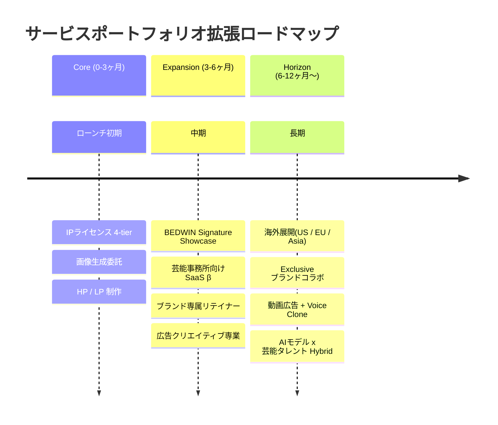

# 05. Service Portfolio Roadmap — サービス拡大の素案

> 渡辺真史 様へのご相談素案 / 2026-04-21

---

## 構成思想

「AIモデル貸出」だけで事業化しようとすると、**ブランド信用に対して客単価が見合わない** リスクがあります。
渡辺様のクリエイティブ領域を最大限活かせる **「サービスの束」** として設計し、案件ごとに深度を選べる構造にしたいと考えております。

サービスを3つのフェーズに分けます:

- **Core(Launch 当初、0-3ヶ月)** — すぐに売れる主力
- **Expansion(3-6ヶ月)** — 既存顧客の深度化 + 新領域
- **Horizon(6-12ヶ月以降)** — 大型案件・海外・独占

> 図 M12: サービス拡張タイムライン(Core → Expansion → Horizon)

---

## 1. Core Services(Launch 当初)

### 1-1. AIモデル IP ライセンス(主力)

4-tier 構造(Lumina で設計済み、Wizard AI に移植):

| Tier | 月額 | 使用範囲 | 想定顧客 |
|---|---|---|---|
| Standard | ¥5,000 / model | EC商品ページのみ | 小規模D2C |
| Extended | ¥15,000 / model | EC + SNS + Web | 中堅ブランド |
| Campaign | Inquire(¥500k-3M/案件想定) | 広告・印刷・動画 | 大手、シーズン施策 |
| Exclusive | From ¥200,000 / model / 月 | カテゴリ独占 | ブランドコラボ |

出典: [pricing-rationale.md](../../../docs/pricing/pricing-rationale.md)

> 図 H05: 4-tier 料金マトリクス(カード型比較)

<table style="width:100%; border-collapse:collapse; font-size:0.9em;">
  <tr>
    <td style="width:25%; background:#0A0A0F; border:1px solid #1A1A2E; padding:14px; vertical-align:top;">
      
Tier 1

      
Standard

      
¥5,000 / model / 月

      

      
使用: EC商品ページのみ

      
顧客: 小規模D2C

    </td>
    <td style="width:25%; background:#0A0A0F; border:1px solid #1A1A2E; padding:14px; vertical-align:top;">
      
Tier 2

      
Extended

      
¥15,000 / model / 月

      

      
使用: EC + SNS + Web

      
顧客: 中堅ブランド

    </td>
    <td style="width:25%; background:#0A0A0F; border:1px solid #1A1A2E; padding:14px; vertical-align:top;">
      
Tier 3

      
Campaign

      
¥500k-3M / 案件

      

      
使用: 広告・印刷・動画

      
顧客: 大手・シーズン施策

    </td>
    <td style="width:25%; background:#0A0A0F; border:1px solid #00D4FF; padding:14px; vertical-align:top;">
      
Tier 4 ★

      
Exclusive

      
¥200k〜 / model / 月

      

      
使用: カテゴリ独占

      
顧客: ブランドコラボ

    </td>
  </tr>
</table>

**渡辺様 × Wizard AI の差別化ポイント**:
- "Wizard AI" として推薦されている安心感(業界信用)
- Character Bible によるブランドでの継続起用性
- 日本語 + 英語両対応、モール規格対応

### 1-2. 画像・動画クリエイティブ生成委託

- **画像**: 1カット ¥5,000-30,000(枚数・複雑性による)
- **動画**: 1本 ¥30,000-200,000(Kling / Seedance ベース、15-60秒)
- Lumina Studio / Video Studio のパイプラインをそのまま使用可能

### 1-3. HP / LP 制作(AI × Webデザイン)

- AIで生成したビジュアル + Next.js / Vercel 実装で **1-2週間** 納期
- 想定単価 ¥300k-800k / サイト(ブランド規模による)
- 制作会社(¥1M-3M / 納期 1-2ヶ月)の **1/3 コスト / 1/4 納期** で競合可能

---

## 2. Expansion(3-6ヶ月)

### 2-1. BEDWIN での AI モデル活用(シグネチャ事例)

**これは渡辺様のご判断次第ですが、可能であればシグネチャ事例として強力です。**

- BEDWIN 26FW / 27SS のルックブック・EC 素材に AI モデル(LUCAS MORI 等)を起用
- **Watanabe-signed Campaign** として、ストリート/AI/クラフトの越境事例
- HYPEBEAST / WWD / 業界メディアへの PR 価値が大きい

※ BEDWIN 側の予算からではなく、**Wizard AI 側のショーケース予算**で制作させていただく、という選択肢もあり得ます。

### 2-2. 芸能事務所向け AI 肖像 IP 管理 SaaS

- 芸能事務所が所属タレントの AI 肖像を管理・ライセンス配布する **内部管理ツール** を SaaS として提供
- 月額 ¥50k-200k / 事務所(規模による)
- **H&M のデジタルツインモデルの日本版構造**(モデル本人が肖像権保有、事務所が管理)
- 渡辺様の芸能業界との接点(Numéro TOKYO 等メディア経由)を入口に

### 2-3. ブランド専属クリエイティブ制作

- 月次リテイナー契約(月¥500k-2M)で、特定ブランドのクリエイティブを継続受注
- 画像 / 動画 / SNS素材 / 広告素材を包括的に提供
- 制作会社の代替としての機能

### 2-4. 広告クリエイティブ専業(Meta / Google / TikTok)

- AI モデルを使った広告クリエイティブを **週次で大量供給**
- 1 パターン ¥10,000-30,000、週20-50パターン納品
- 月次 ¥500k-1.5M の継続契約として成立しやすい
- Meta / Google広告のアカウント運用代行(TomorrowProof 既存)と組み合わせ可能

---

## 3. Horizon(6-12ヶ月以降)

### 3-1. 海外展開

**対象市場**:
- **US** — 日系ブランドのローカライズ需要、Supreme / Aimé Leon Dore 周辺のカルチャー顧客
- **EU** — EU AI Act §50 対応が必須化 → 法務的に安全な日本発 AI エージェンシーとしての競争力
- **アジア** — 韓国 / シンガポール / 香港のラグジュアリー市場

**運用**:
- 海外ブランドからの案件は **USD / EUR 建て** で受注、日本拠点で制作
- 渡辺様の国際ネットワーク(HYPEGOLF / 海外セレクトショップ接点)を opening door に

### 3-2. カテゴリ独占ブランドコラボ(Exclusive Tier)

- 1 ブランドが特定AIモデルの **カテゴリ内独占利用権** を月額 ¥200k-3M で購入
- スポーツウェア / ストリート / デニム / ジュエリー / 時計 等、カテゴリ別の独占
- 例: "LUCAS MORI × [Brand]" のように、AI モデルをブランドアンバサダーとして起用

### 3-3. 動画広告 / 音声合成(ElevenLabs / Seedance 連携)

- 15秒 / 30秒 / 60秒の AI 動画広告
- Voice Clone 連携で、モデルが実際に話す動画キャンペーン
- TikTok / Reels / YouTube Shorts 向けの **バイラル広告クリエイティブ** を量産
- 1本 ¥100k-500k の単価帯

### 3-4. AIモデル × 芸能タレントのハイブリッド企画

- 既存タレント × AIモデルの共演キャンペーン(Coach × imma の事例が参考)
- 事務所連携が必要な高難度案件、単価 ¥5M-50M 帯
- 渡辺様と事務所サイドの関係性が大きく活きる領域

---

## 4. フェーズ別の渡辺様/KOZUKI 貢献マップ

| Phase | 主要サービス | 渡辺様の貢献 | KOZUKI の貢献 |
|---|---|---|---|
| **Core (0-3m)** | IP ライセンス、画像生成、HP制作 | ブランド顔、新規1社紹介 | 実装全般、営業、制作 |
| **Expansion (3-6m)** | BEDWIN showcase、芸能SaaS、ブランド専属 | BEDWIN 監修、芸能窓口 | SaaS 開発、運営、PR |
| **Horizon (6-12m)** | 海外展開、Exclusive、動画広告 | 海外窓口、独占ブランド審査 | 海外オペレーション、動画制作、多言語対応 |

> 図 M13: 収益ストリーム & サービス連鎖

```mermaid
graph LR
    subgraph IN["インプット"]
        WB["渡辺様<br/>信用 / 美学<br/>ネットワーク"]
        KZ["KOZUKI<br/>技術 / 運営<br/>マーケ"]
    end

    subgraph CORE["Core サービス"]
        IP["IPライセンス<br/>¥5k-15k x 多数"]
        GEN["画像生成委託<br/>¥5k-30k / カット"]
        HP["HP / LP制作<br/>¥300k-800k / サイト"]
    end

    subgraph EXP["Expansion サービス"]
        SIG["BEDWIN Showcase<br/>PR価値 大"]
        SAAS["芸能SaaS<br/>¥50k-200k / 月"]
        RET["ブランド専属<br/>¥500k-2M / 月"]
    end

    subgraph HOR["Horizon サービス"]
        GLOBAL["海外案件<br/>USD / EUR建て"]
        EXCL["Exclusive<br/>¥200k-3M / 月"]
        VIDEO["動画広告<br/>¥100k-500k / 本"]
    end

    IN --> CORE
    CORE --> EXP
    EXP --> HOR
    CORE -.既存顧客深度化.-> EXP
    EXP -.事例化 PR.-> HOR

    classDef input fill:#FFB800,color:#050508,stroke:#FFB800
    classDef core fill:#00D4FF,color:#050508,stroke:#00D4FF
    classDef exp fill:#00FF88,color:#050508,stroke:#00FF88
    classDef hor fill:#FAFAFA,color:#050508,stroke:#FAFAFA

    class WB,KZ input
    class IP,GEN,HP core
    class SIG,SAAS,RET exp
    class GLOBAL,EXCL,VIDEO hor
```

---

## 5. 各サービスの優先度判定基準

案件受注判断で、渡辺様と揃えたい基準:

| 判断軸 | ○(受ける) | ×(受けない) |
|---|---|---|
| ブランドの格 | ブランドの世界観がある | 量産型・ファストファッションで世界観なし |
| クリエイティブ余地 | 渡辺様のディレクションが活きる | 均質な通販用素材のみ |
| 既存Wizard顧客との重複 | 重複なし | 重複あり(即断る) |
| 法務的安全性 | EU AI Act / 景表法対応が可能 | グレー領域(NFT関連など慎重案件は別途判断) |
| リードタイム | 2週間以上の余裕 | 48時間以内の緊急(対応力を考え慎重に) |

---

## 6. サービス外(=やらないこと)の明示

**明確に線を引きたい領域**:

- アダルト / エログロ系のクリエイティブ
- ディープフェイク(実在人物の AI なりすまし)
- 既存 Wizard Models 所属モデルの無断 AI 化
- 政治広告・選挙関連
- 医療効能の誇大表示に使われる画像
- 他の AI モデルエージェンシーの OEM 受託(自社ブランドで勝負)

これらは Ethics Code として明文化し、営業段階で顧客に開示します。

---

**次章**: [`06-phased-roadmap.md`](06-phased-roadmap.md) — フェーズ別の具体計画
