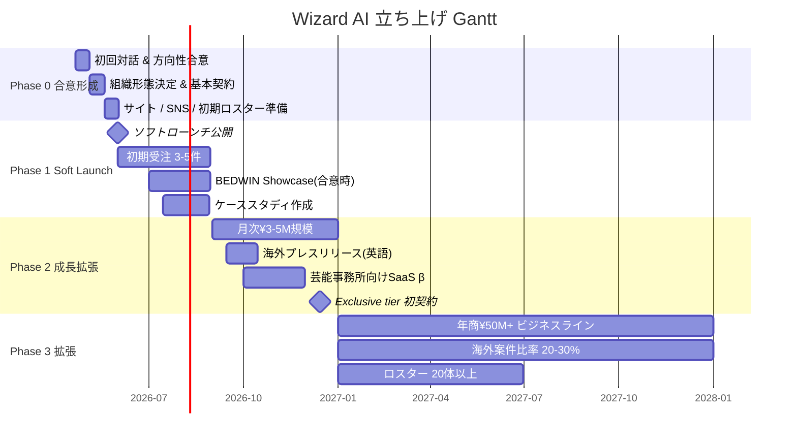
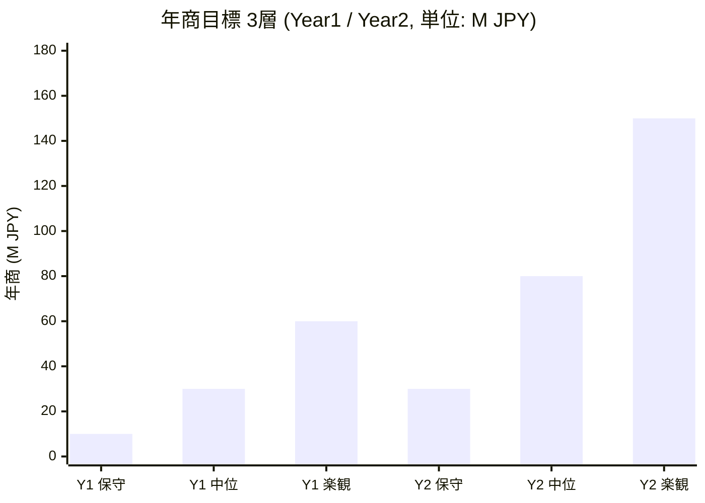
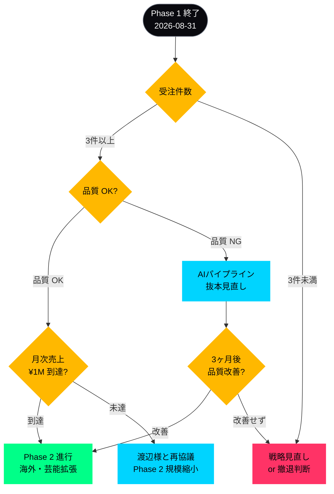

# 06. Phased Roadmap — フェーズ別計画(素案)

> 渡辺真史 様へのご相談素案 / 2026-04-21
> 数字は "目標感" です。渡辺様との対話後、現実的なラインで再設計します。

---

## 全体俯瞰 — Phased Roadmap Gantt

> 図 M14: Phase 0 → Phase 3 の全体俯瞰 Gantt(2026-04 〜 2027-12)



---

## Phase 0 — 合意形成・組織準備(2026-04-21 〜 05月末)

### ゴール
- 事業化する/しないの方向性合意
- 組織形態の決定(Option A/B/C)
- Soft Launch の準備完了

### アクション

| Week | アクション | 担当 |
|---|---|---|
| W0 (4-21〜) | 初回対話(30-60分) | 渡辺様 + KOZUKI |
| W1 (4-28〜) | 方向性文書化、Option 選定 | KOZUKI ドラフト → 渡辺様承認 |
| W2 (5-05〜) | 簡易契約書(NDA + 基本合意) | 弁護士確認(TomorrowProof 側) |
| W3 (5-12〜) | Wizard AI サイト・メール・SNS 準備 | KOZUKI |
| W4 (5-19〜) | 初期ロスター(14体)Wizard AI 版 beauty shot 調整 | KOZUKI + 渡辺様確認 |

### マイルストーン
- ✅ 合意 or 不合意の明確化(5月末)
- ✅ 基本合意書締結(合意の場合)
- ✅ サイト準備完了

---

## Phase 1 — Soft Launch & 初期受注(2026-06 〜 08月)

### ゴール
- 初期案件 3-5 件受注(渡辺様ネットワーク経由 + KOZUKI マーケ経由)
- ケーススタディ 2-3 件作成
- 運営フローの確立

### 月次目標感(保守的)

| 月 | 新規受注 | 月次売上目標感 | アクション |
|---|---|---|---|
| 6月 | 1-2件 | ¥100k-500k | Soft launch、Phase 1 ケーススタディ 1件 |
| 7月 | 2-3件 | ¥300k-800k | 渡辺様紹介案件 + 自然獲得 |
| 8月 | 3-5件 | ¥500k-1.5M | BEDWIN showcase(合意の場合)、PR 展開 |

### 受注チャネル

```
Wizard AI への問合せ
  ├── 渡辺様ネットワーク(新規紹介)     40%
  ├── SEO(lumina系 long-tail)         20%
  ├── Web広告(Meta / Google)          20%
  ├── HYPEBEAST等メディア露出         10%
  └── 直接営業(KOZUKI 側)             10%
```

### マイルストーン
- ✅ 初案件納品(6月中)
- ✅ BEDWIN showcase 公開(合意の場合、8月まで)
- ✅ 月次売上 ¥1M 到達(8月目標)

---

## Phase 2 — 成長・海外・芸能への拡張(2026-09 〜 12月)

### ゴール
- 月次 10-20 件受注、月次売上 ¥3-5M 規模
- 海外案件 1-2件
- 芸能事務所案件 1-2件
- Exclusive tier 初契約獲得

### アクション

| 月 | 主要アクション |
|---|---|
| 9月 | 海外向けプレスリリース(英語)、NYFW / LFW に合わせた露出 |
| 10月 | 芸能事務所向け SaaS β提供、3-5社トライアル |
| 11月 | BEDWIN × Wizard AI 事例で業界メディア露出 |
| 12月 | 年末キャンペーン案件(Campaign tier)受注、2027年度計画策定 |

### 組織拡張

- Phase 2 後半で、KOZUKI に加え **運営アシスタント1名** を業務委託で追加(顧客対応・制作進行)
- 渡辺様のご負担は引き続き **月60分以内** を目標

### マイルストーン
- ✅ 海外初案件納品
- ✅ 芸能事務所トライアル 3社以上
- ✅ Exclusive 契約 1件以上

---

## Phase 3 — 拡張・別カテゴリ展開(2027年 1月〜)

### ゴール
- 年商 ¥50M 以上のビジネスラインとして確立
- サービスポートフォリオを 5 領域に拡大
- ロスター 20 体以上
- 海外案件比率 20-30%

### 検討領域(渡辺様との対話で選別)

- 宝飾・時計・ラグジュアリー領域の AIキャンペーン(Tiffany 事例の延長)
- ゴルフ / スポーツ領域(HYPEGOLF 接点)
- 音楽・ストリート領域(DAYZ / BEDWIN 文脈)
- 住空間・ライフスタイル領域(AIモデルを家具・インテリア広告に起用)
- AIモデル x NFT / Web3(慎重、渡辺様判断)

---

## KPI 参考値(目標感)

### Year 1(2026年)

| 指標 | 保守 | 中位 | 楽観 |
|---|---|---|---|
| 年商 | ¥10M | ¥30M | ¥60M |
| 案件数 | 20 | 50 | 80 |
| 継続契約数 | 5 | 15 | 30 |
| 海外案件比率 | 0% | 5% | 15% |

### Year 2(2027年)

| 指標 | 保守 | 中位 | 楽観 |
|---|---|---|---|
| 年商 | ¥30M | ¥80M | ¥150M |
| 案件数 | 60 | 150 | 250 |
| 継続契約数 | 20 | 50 | 80 |
| 海外案件比率 | 10% | 25% | 40% |

**注記**: これらはすべて **目標感** です。AIファッションモデル市場のCAGR 21.7%([OpenPR 2026](https://www.openpr.com/news/4471921/ai-fashion-models-market-size-growth-trends-and-forecast))を踏まえた妥当レンジで設計しておりますが、実際の数字はマーケット反応・渡辺様のネットワーク活用度・競合状況で大きく変動します。

> 図 H06: KPI 3層(保守 / 中位 / 楽観)バーチャート



> 中位シナリオで Year 1 ¥30M → Year 2 ¥80M = **2.67x 成長**。業界CAGR 21.7% に対して十分な挑戦的レンジ。

---

## リスクと対応

| リスク | 対応 |
|---|---|
| Google / Meta の AI コンテンツ制限強化 | 透明性マーキング(EU AI Act準拠)で先手対応、ポリシーに合わせた素材分類 |
| 大手(H&M / Mango)の日本上陸・直接参入 | 伝統エージェンシー連携(Wizard AI のブランド)で差別化、ニッチ深掘り |
| 渡辺様のご負担増加 | 月60分制限の厳守、判断の80%を KOZUKI に権限委譲 |
| 既存Wizard顧客との接触リスク | 顧客リスト照合プロセスを営業開始前に必ず通す |
| AI生成品質の揺れ | Character Bible + 人間QAの 2 重チェック(既存パイプライン) |
| 円安による API コスト上昇 | 価格パススルー条項、四半期ごと見直し |

---

## Phase 終了条件(撤退ライン)

双方にとって健全な判断を担保するため、以下を **明示的なゴー・ノーゴーライン** としたいと考えております。

- **Phase 1 終了時(8月末)**:
  - 受注 3件未満 → 戦略見直し or 撤退判断
  - 受注はあるが品質不合格 → AI パイプラインの抜本見直し
- **Phase 2 終了時(12月末)**:
  - 月次売上 ¥1M 未満 → 事業継続の是非を渡辺様と再協議
  - 渡辺様負担が月60分超過常態化 → 運営体制の再設計

→ **撤退判断も含めて、最初から想定に入れておく** ことを素案に書いております。渡辺様のご負担にならないようにするため、無理な継続はしない姿勢です。

> 図 M15: 撤退判断 Decision Tree(Phase 1 終了 8 月末)



### リスクマップ(Impact × Likelihood)

> 図 H07: 主要リスクの 2x2 マッピング

<div>
<table style="width:100%; border-collapse:collapse; font-size:0.85em;">
  <tr>
    <td style="width:20%; background:#0A0A0F; border:1px solid #1A1A2E; padding:8px;"></td>
    <td style="width:40%; background:#0A0A0F; color:#FAFAFA; border:1px solid #1A1A2E; padding:10px; text-align:center; font-weight:700;">Likelihood 低</td>
    <td style="width:40%; background:#0A0A0F; color:#FAFAFA; border:1px solid #1A1A2E; padding:10px; text-align:center; font-weight:700;">Likelihood 高</td>
  </tr>
  <tr>
    <td style="background:#0A0A0F; color:#FAFAFA; border:1px solid #1A1A2E; padding:10px; font-weight:700;">Impact 高</td>
    <td style="background:#0A0A0F; color:#FFB800; border:1px solid #1A1A2E; padding:10px;">
      大手(H&M/Mango)の直接日本参入<br/>
      <span style="color:#6B7280; font-size:0.85em;">→ 伝統連携で差別化</span>
    </td>
    <td style="background:#0A0A0F; color:#FF3366; border:1px solid #FF3366; padding:10px;">
      <strong>AI 生成品質の揺れ</strong><br/>
      <span style="color:#6B7280; font-size:0.85em;">→ Character Bible + QA 二重</span><br/>
      <strong>Google / Meta AI制限強化</strong><br/>
      <span style="color:#6B7280; font-size:0.85em;">→ EU AI Act準拠で先手</span>
    </td>
  </tr>
  <tr>
    <td style="background:#0A0A0F; color:#FAFAFA; border:1px solid #1A1A2E; padding:10px; font-weight:700;">Impact 低</td>
    <td style="background:#0A0A0F; color:#6B7280; border:1px solid #1A1A2E; padding:10px;">
      円安API費上昇<br/>
      <span style="color:#6B7280; font-size:0.85em;">→ 価格パススルー条項</span>
    </td>
    <td style="background:#0A0A0F; color:#00D4FF; border:1px solid #1A1A2E; padding:10px;">
      渡辺様負担月60分超過<br/>
      <span style="color:#6B7280; font-size:0.85em;">→ 80%判断をKOZUKI委譲</span><br/>
      既存顧客との接触事故<br/>
      <span style="color:#6B7280; font-size:0.85em;">→ 照合プロセス必須化</span>
    </td>
  </tr>
</table>
</div>

※ HTMLが崩れる viewer では Phase 別 Decision Tree(図 M15)のみお読みください。

---

**次章**: [`07-immediate-actions.md`](07-immediate-actions.md) — 初回対話で議論したいこと
