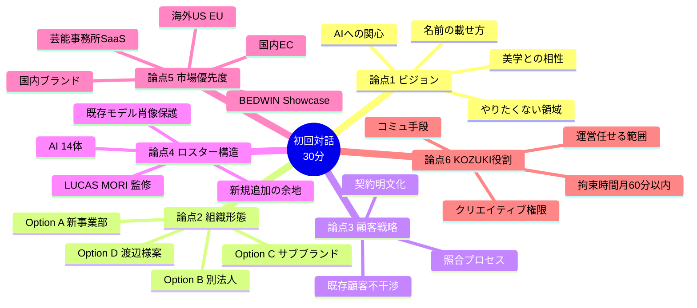
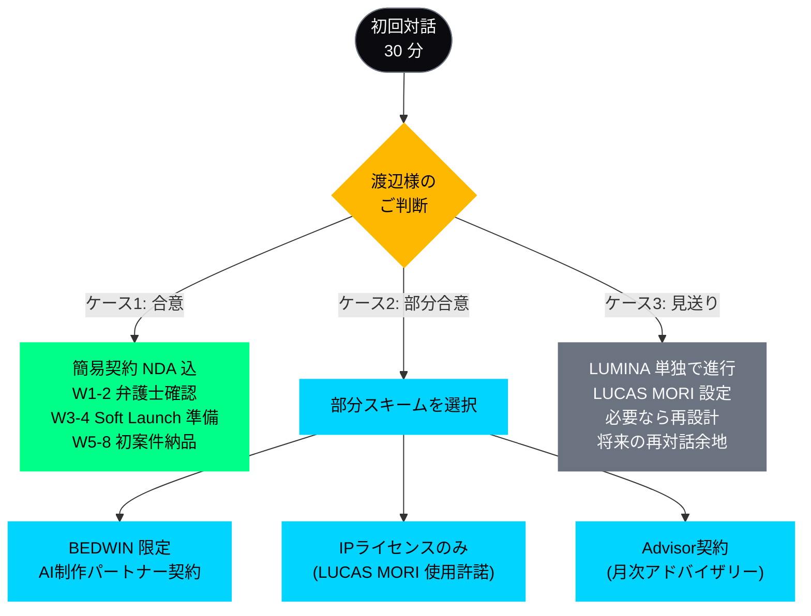

# 07. Immediate Actions — 初回対話で議論したいこと

> 渡辺真史 様へのご相談素案 / 2026-04-21

---

## 初回対話の目的

**本対話は、提案の採否を決める場ではありません。**
渡辺様が AI というテクノロジー、そして新領域のビジネスと、**どう関わりたいか / 関わりたくないか** を伺うことが目的です。

---

> 図 M16: 初回対話 6 論点の全体俯瞰 mindmap

---

## 議論したい 6 論点

### 論点 1 — ビジョン確認(15分)

**「渡辺様は AI でどんなクリエイティブをやりたいとお考えでしょうか?」**

派生質問:
- AI を道具として使う側(= BEDWIN のクリエイティブ拡張)と、AI 自体を事業化する側(= Wizard AI)、どちらに関心がおありか
- 「これは AI でやりたくない」という領域があるか
- 渡辺様が BEDWIN / DAYZ / HYPEGOLF で培ってきた美学のうち、AI と最も相性が良いと感じる領域はどこか
- ブランドとしての「Wizard AI」が立ち上がった時、どう自分の名前を載せたいか / 載せたくないか

### 論点 2 — 組織形態(5分)

**「Wizard AI として立ち上げるか、別のかたちが良いか。」**

選択肢:
- Option A: Wizard Models の新事業部として
- Option B: 別法人(合弁会社)として
- Option C: Wizard Models のサブブランド(最軽量)
- Option D: 渡辺様が別にお考えのかたち

**判断基準(案)**: 既存事業への負担が最小、渡辺様のブランドリスクが最小、立ち上げスピード、将来の拡張性

### 論点 3 — 顧客戦略(5分)

**「既存 Wizard Models 顧客への不干渉を、どう技術的・契約的に担保するか。」**

確認事項:
- 既存顧客リストの共有範囲(TomorrowProof 側は見ない)
- 案件問合せ時の照合プロセス(新規かどうかを渡辺様が確認してから受注)
- 契約書への明文化

### 論点 4 — ロスター構造(5分)

**「AI モデル 14 体 + 人間モデル(希望者)のハイブリッドをどう設計するか。」**

派生質問:
- 14体のうち、LUCAS MORI は BEDWIN muse 設定を前提に設計しております。そのまま使用 / 再設計 のご希望
- 既存 Wizard モデルの AI 肖像化は初期「やらない」で合意
- 将来、渡辺様監修で新規 AI モデルを2-4体追加する余地

### 論点 5 — 海外・芸能展開の優先度(5分)

**「どの市場から着手するのが良さそうか。」**

選択肢の優先度づけ:
- 国内EC(小-中堅D2C) — 入口として最速、単価低め
- 国内ブランド(ストリート / ラグジュアリー) — 渡辺様の領域、単価高め
- 海外ブランド(US / EU) — 渡辺様のネットワーク活用、単価最高、複雑性高
- 芸能事務所(SaaS) — 別アプローチが必要、中長期
- BEDWIN showcase — シグネチャ事例化、判断は渡辺様

### 論点 6 — KOZUKI の役割期待(5分)

**「渡辺様から見て、KOZUKI の役割はどうあってほしいか。」**

派生質問:
- 運営のすべてを任せたいか、一部を社内で握っておきたいか
- クリエイティブディレクションの権限バランス(渡辺様 vs KOZUKI)
- コミュニケーション頻度・手段の希望(Slack / Discord / Email / 電話 / 対面)
- 月の拘束時間のご希望(60分以内 / もっと少なく / 必要時のみ)

---

## 対話用の補助資料(当日お見せできるもの)

以下、必要に応じて当日共有可能な素材:

### A. AIモデル 14体 ポートフォリオ

- 各モデルの beauty shot
- Character Bible 抜粋(1モデルにつき1枚のプロフィールカード)
- 特に LUCAS MORI: BEDWIN 26SS muse 設定の全貌

ファイル: `public/agency-models/*/beauty.png`(14体分)
参照: [docs/legal/character-bibles/](../../../docs/legal/character-bibles/)

### B. Lumina Studio / Video Studio のライブデモ

- 実際の画像生成パイプライン
- 動画生成(Kling I2V → ElevenLabs Voice)
- 本番稼働中: https://lumina-model-agency.vercel.app/

### C. 競合・市場資料

- Top8 伝統エージェンシー調査サマリー([journal/2026/04/19.md](../../../journal/2026/04/19.md))
- 4-tier pricing の論理根拠([pricing-rationale.md](../../../docs/pricing/pricing-rationale.md))
- SERP 調査結果([seo-strategy.md](../../../docs/design/seo-strategy.md))

---

## 初回対話後のネクストステップ(例)

> 図 M17: 意思決定フロー — Go / Partial / No-Go

**ケース 1: 方向性合意**
- Week 1-2: 簡易基本合意書(NDA込)ドラフト → 弁護士確認
- Week 3-4: Soft launch 準備(サイト / SNS / 初期ロスター整備)
- Week 5-8: 初案件受注 + 納品

**ケース 2: 部分合意(一部サービスのみ)**
- 例1: 「BEDWIN のクリエイティブ拡張のみ協力したい」 → BEDWIN 専属の AI 制作パートナー契約
- 例2: 「Wizard AI はやらないが、LUCAS MORI キャラクターは使って良い」 → IP ライセンス契約のみ
- 例3: 「名前を貸すのみ」 → advisor 契約 + 月次アドバイザー報酬

**ケース 3: 不合意(見送り)**
- 本ドキュメントはお手元で破棄いただくか、将来気が向いた時のために保管いただいても問題ありません
- KOZUKI は単独で LUMINA として事業を進めます(LUCAS MORI の muse 設定は、渡辺様のご判断を尊重して変更も可)
- 再度の対話機会をいつか頂ければ幸いです

---

## 最後に

渡辺様のお時間は非常に貴重と承知しております。
本ドキュメントは事前の論点整理であり、**対話でのご意見を伺うことが主** ですので、細部を事前にご確認いただく必要はありません。

「こういう方向ならやっても良い」「ここは違う」と、率直なご意見を聞かせていただければ、それを持ち帰って再設計いたします。

> 図 H08: 初回対話の予約 — Google Meet URL

  
初回対話(30 分 / Google Meet)

  
ご都合の良い時間帯をご選択ください

  

    <a href="https://calendar.app.google/4EPiRfG5wYjJfn4J6" style="color:#00D4FF; font-size:1.1em; text-decoration:none; font-family:monospace;">https://calendar.app.google/4EPiRfG5wYjJfn4J6</a>
  

  

    株式会社TomorrowProof 代表 KOZUKI TAKAHIRO 
    Email: sackozuki@gmail.com
  

**MTG URL**: https://calendar.app.google/4EPiRfG5wYjJfn4J6

株式会社TomorrowProof
代表 KOZUKI TAKAHIRO
